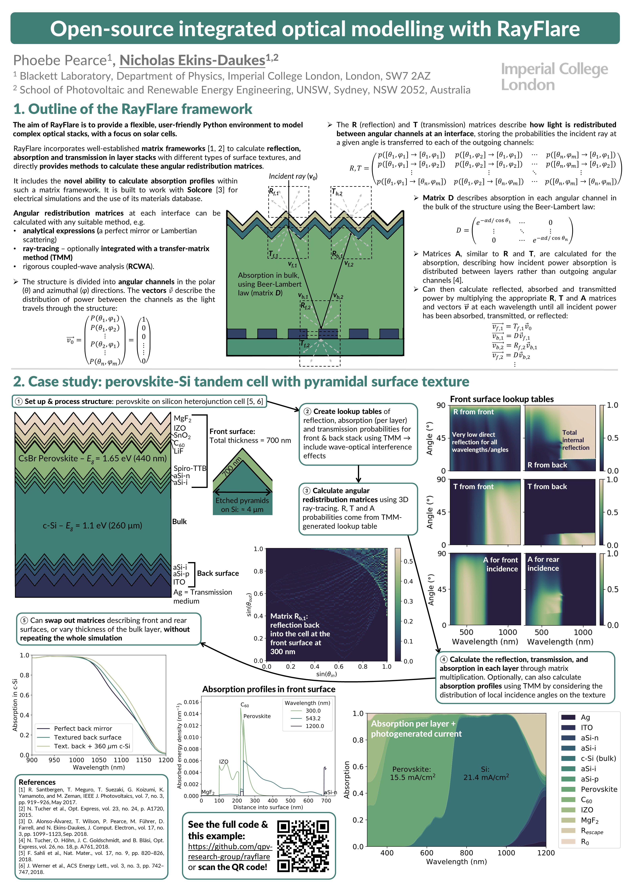

# rayflare
Open-source, integrated optical modelling of complex stacks. RayFlare incorporates the transfer-matrix method (TMM), 
ray-tracing and rigorous coupled-wave analysis (RCWA/FMM), in addition to an angular redistribution matrix method which allows multiple 
methods to be coupled across a single structure to calculate total absorption/reflection/transmission, absorption per 
layer, and absorption profiles. 

You can view RayFlare's documentation, including installation instructions [here](https://rayflare.readthedocs.io/en/latest/).

