.. role:: raw-latex(raw)
   :format: latex
..

.. contents::
   :depth: 3
..

.. _optical:rayflare:

Theory
====================================================

Accurate and efficient optical modelling of different types of
structures (planar vs. structured layers, random vs. periodic
structures, nano vs. micro-scale or larger) requires the use of
different computational methods. Although in principle most problems can
be solved by the most sophisticated type of solver available (in the
case of the types of optical simulations we are considering, a full
Maxwell solver), this is often not computationally efficient and can be
less insightful than using a method with appropriate simplifications for
the structure being considered. For instance, modelling micron-sized
pyramids with a Maxwell solver such as RCWA or FDTD (finite-difference
time-domain), or using RCWA to calculate the effect of a distributed
Bragg reflector (DBR) made of planar layers, is possible and should
yield correct results but is both computationally slow compared to a
more physically appropriate method (e.g. ray-tracing and TMM,
respectively, for the examples given), and does not generally lend
additional insight into the physical processes that choosing a simpler
model would not. Especially if the problem being considered has an
optimization aspect, requiring the simulation of many different
structures, it is important to choose an optical modelling method which
can accurately describe the relevant structure but is not unnecessarily
computationally intensive. The development of RayFlare began due to a
desire to integrate the various optical modelling codes developed and
adapted for different types of problems over the course of the PhD into
a single Python package, which can be used to solve a wide range of
optical problems by implementing ray-tracing, TMM, RCWA, simple
Beer-Lambert law absorption, analytic models for surface scattering
(e.g. perfect mirrors or Lambertian scattering) and an OPTOS-type
angular matrix formalism :raw-latex:`\cite{Eisenlohr2015, Tucher2015}`.
The angular matrix formalism allows coupling of surfaces treated with
the same or different optical methods across a thick, incoherent layer.
By using Solcore’s material system and database, and ability to define
new materials easily, also expanded over the course of the PhD, it thus
becomes possible to model the wavelength-dependent optical behaviour of
a wide variety of structures including structures involving planar
layers of any thickness, structures with diffraction gratings, or
structures with larger-scale textures such as pyramids. Combining e.g. a
structure with pyramids on one side and planar layers on the other, or a
thick structure with a diffraction grating on one side, is possible
through the matrix framework, and comparison with idealized cases such
as a perfect mirror or Lambertian scattering is easy and fast.

.. figure:: raytrace_schematic.png
   :name: fig:raytrace
   :width: 80.0%

   Fig. 1. a) Schematic of three-dimensional ray-tracing for pyramids. b)
   Illustration of the meaning of the local angle of incidence
   :math:`\theta_l` and the global angle of incidence :math:`\theta_g`.

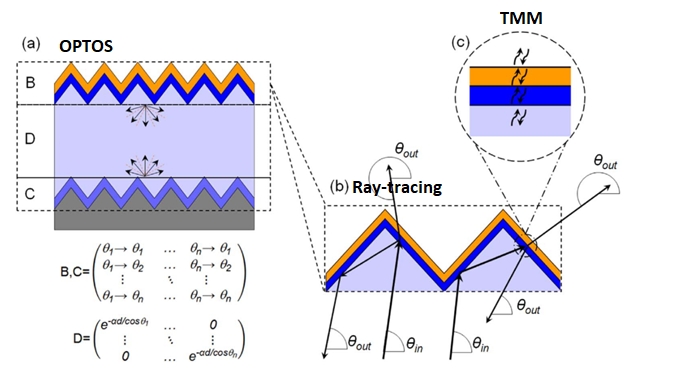

   Fig. 2. Schematic of the angular matrix framework, specifically when used
   with an integrated ray-tracing/TMM method, showing a) the function of
   the matrices B, C and D; b) how the matrix B could be calculated
   through ray-tracing; and c) how the TMM can be used with the
   ray-tracer to calculate R, A and T appropriately. From
   :raw-latex:`\cite{Riverola2018}`.

The matrix framework used is similar to OPTOS
:raw-latex:`\cite{Tucher2015, Eisenlohr2015}` as discussed in Section
`[litrev:lighttrapping] <#litrev:lighttrapping>`__. It divides the
optical structure into three parts: the front surface, the bulk, and the
back surface [1]_. The front and back interfaces may be made up of
several layers, or be textured, as long as there is a way to calculate
the reflection and transmission for different angles of incidence, as
well as (if relevant) the absorption in each layer of the interface. The
matrix method itself is straightforward, and essentially amounts to
matrix multiplication. For both interfaces, using any suitable optical
method (e.g. TMM, ray-tracing, RCWA, or analytical expressions), a
matrix must be constructed which describes how light incident on the
interfaces is redistributed into other angles, or absorbed. In two
dimensions, with a non-absorbing interface, this matrix will relate some
polar angle :math:`\theta_{in}` to one or more :math:`\theta_{out}`,
with the matrix elements describing what fraction of incident light is
directed into each outgoing angle. This can be expanded to three
dimensions by including an azimuthal angle :math:`\phi`
:raw-latex:`\cite{Tucher2015}`. The angular matrix framework and
structures of the matrices in 2D, specifically using an integrated
ray-tracing/TMM approach, are illustrated in Fig.
`2 <#fig:optosdiag>`__. The ray-tracer takes the probabilities of
reflection and transmission from an angle- and wavelength-dependent TMM
calculation, to account for the multi-layer structure of the front
surface of a realistic solar cell. The OPTOS framework has been expanded
since its initial publication to include absorption in surface layers
:raw-latex:`\cite{Tucher2018}`; this ability was also developed
independently part of RayFlare over the course of the PhD approximately
simultaneously :raw-latex:`\cite{Pearce2019a}`. While the existing
matrix frameworks as discussed in Section
`[litrev:lighttrapping] <#litrev:lighttrapping>`__ provide methods for
combining different surface textures, there is no existing open-source
modelling package which combines the angular matrix method with the
actual generation of the matrices describing the redistribution at each
interface. OPTOS provides only the matrix multiplication for calculating
absorption in the bulk layers, but the matrices have to be computed and
stored in the correct format by the user, while GenPro4
:raw-latex:`\cite{Santbergen2017}` is a proprietary software which
combines the matrix approach with the generation of matrices (but does
not include a RCWA or a method for calculating diffraction from
wavelength-scale periodic structures). The aim of RayFlare is to provide
on open-source solution integrating both the generation of the matrices
and the matrix multiplication to generate useful results, as well as
tools for visualizing the outputs and matrices generated.

This section describes the work undertaken so far in developing the
integrated optical modelling package RayFlare. The new ray-tracing
implementation, developed specifically for RayFlare, is discussed first,
followed by the description of the matrix method.

.. _optical:rt:

Ray-tracing
-----------

The ray-tracer used was written in Python3 specifically for use with
RayFlare. The basis of the ray-tracer is the definition of a surface in
terms of the Delaunay triangulation of a set of :math:`(x, y, z)` points
which define a surface. This could be a very simple surface such as
regular V-grooves or pyramids, or a more complicated surface based on
e.g. an AFM scan of a real surface structure.

The equations for a point on a line :math:`\mathbf{l}` (i.e. a ray) and
a plane :math:`\mathbf{p}` (i.e. one of the planes defining the surface)
can be expressed in parametric form as:

.. math::

   \label{eq:lineplane}
   \begin{aligned}
   \mathbf{l} &= \mathbf{l_a}+\mathbf{d} t \\
   \mathbf{p} &= \mathbf{p}_{0}+\mathbf{p}_{01} u+\mathbf{p}_{02} v
   \end{aligned}

where :math:`\mathbf{d}` is a vector pointing in the ray’s direction of
travel. The meaning of the symbols relating to the line-plane
intersection is shown in Fig. `3 <#fig:intersection>`__\ a. Setting the
RHS of both equations in eq. `[eq:lineplane] <#eq:lineplane>`__ equal to
one another (which occurs at the intersection of the line
:math:`\mathbf{l}` and the plane :math:`\mathbf{p}`) and rearranging,
the following matrix equation can be found:

.. math::

   \label{eq:intersect}
   \left[\mathbf{l}_{a}-\mathbf{p}_{0}\right]=\left[\begin{array}{lll}
   -\mathbf{d} & \mathbf{p}_{01} & \mathbf{p}_{02}
   \end{array}\right]\left[\begin{array}{l}
   t \\
   u \\
   v
   \end{array}\right]

Note that since :math:`\mathbf{d}`, :math:`\mathbf{p}_{01}` and
:math:`\mathbf{p}_{02}` are vectors, the first term on the RHS of this
equation is a 3 by 3 matrix.

This matrix equation can be solved in the standard way, by inverting the
matrix, which after rearranging and multiplying out gives:

.. math::

   \label{eq:tuv}
   \begin{aligned}
   t=&\frac{\left(\mathbf{p}_{01} \times \mathbf{p}_{02}\right) \cdot\left(\mathbf{r}_{a}-\mathbf{p}_{0}\right)}{-\mathbf{d} \cdot\left(\mathbf{p}_{01} \times \mathbf{p}_{02}\right)} \\
   u=&\frac{\left(\mathbf{p}_{02} \times-\mathbf{d}\right) \cdot\left(\mathbf{r}_{a}-\mathbf{p}_{0}\right)}{-\mathbf{d} \cdot\left(\mathbf{p}_{01} \times \mathbf{p}_{02}\right)} \\
   v=&\frac{\left(-\mathbf{d} \times \mathbf{p}_{01}\right) \cdot\left(\mathbf{r}_{a}-\mathbf{p}_{0}\right)}{-\mathbf{d} \cdot\left(\mathbf{p}_{01} \times \mathbf{p}_{02}\right)}
   \end{aligned}

For the intersection of a triangular surface with corners at
:math:`\mathbf{p}_{0}`, :math:`\mathbf{p}_{1}` and
:math:`\mathbf{p}_{2}`, with a forward-travelling ray, the following
must be satisfied:

-  :math:`t > 0`, since the ray is travelling forward; :math:`t < 0`
   means the intersection point lies behind the point of origin of the
   ray

-  :math:`u > 0` and :math:`v > 0` for the point to lie inside the
   triangle

-  :math:`u + v \leq 1` for the point to lie inside the triangle

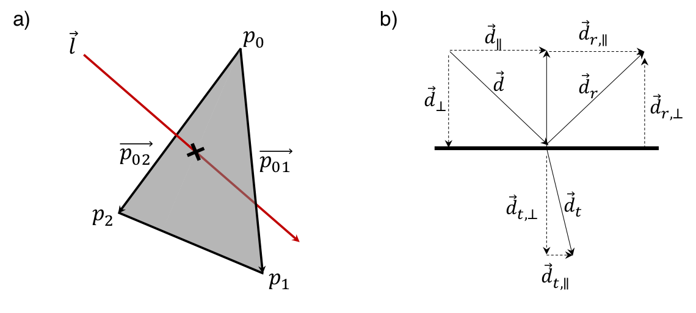

   Fig. 3. a) Intersection of a line with a finite, triangular plane. b)
   Reflection and transmission of a ray through an interface (in this
   case, from low to high refractive index).

This calculation is straightforward to carry out for all the triangles
which define a surface; however, looping through each surface and
checking whether the ray intersects with it is computationally
inefficient. For a complicated surface, such as one defined by an AFM
scan, there may be hundreds or thousands of individual triangles; even
for a single square-based pyramid, there are four surfaces to check.
Thus, vectorizing this calculation so that for any given line, all
surfaces can be checked at once will lead to much faster code. This can
be done by defining matrices :math:`P_0`, :math:`P_1` and :math:`P_2`
which contain the :math:`p_0`, :math:`p_1`, and :math:`p_2` points of
all the surfaces in the triangulation, and matrix versions of
:math:`\mathbf{d}` and :math:`\mathbf{r}_a`:

.. math::

   \begin{aligned}
   P_{0}=\left[\begin{array}{c}
   \mathbf{p}_{0, I} \\
   \mathbf{p}_{0, II} \\
   \vdots\\
   \mathbf{p}_{0, N}
   \end{array}\right] && R_{a}=\left[\begin{array}{c}
   \mathbf{r}_{a} \\
   \mathbf{r}_{a} \\
   \vdots\\
   \mathbf{r}_{a}
   \end{array}\right] && D=\left[\begin{array}{l}
   \mathbf{d} \\
   \mathbf{d} \\
   \vdots \\

   \mathbf{d}
   \end{array}\right]
   \end{aligned}

where in the first equation, :math:`\mathbf{p}_{0, I}` refers to the
:math:`p_0` coordinates of the first triangle in the surface
triangulation, :math:`\mathbf{p}_{0, II}` refers to the second triangle,
etc.

Eq. `[eq:tuv] <#eq:tuv>`__ has some vectors which appear multiple times.
Matrix forms of these values can be computed once, then used in the
calculation of matrix forms of :math:`t`, :math:`u` and :math:`v`. The
following quantities are defined:

.. math::

   C=\left[\begin{array}{c}
   \left(\mathbf{p}_{1, I}-\mathbf{p}_{0, I}\right) \times\left(\mathbf{p}_{2, I}-\mathbf{p}_{0, I}\right) \\
   \left(\mathbf{p}_{1, II}-\mathbf{p}_{0,II}\right) \times\left(\mathbf{p}_{2,II}-\mathbf{p}_{0,II}\right) \\
   \vdots \\ 
   \left(\mathbf{p}_{1, N}-\mathbf{p}_{0, N}\right) \times\left(\mathbf{p}_{2, N}-\mathbf{p}_{0, N}\right)
   \end{array}\right] = P_{01} \times P_{02}

:math:`C` is a matrix with dimensions
:math:`(n_{\textrm{triangles}}, 3)` and contains the cross products of
:math:`\mathbf{p}_{01}` and :math:`\mathbf{p}_{02}` for each of the
:math:`N` triangles in the surface (one cross product per row). The
‘:math:`\times`’ symbol in the second step is used to mean the row-wise
cross product rather than the more standard cross or outer product. Note
that because :math:`C` depends exclusively on the surface itself and not
on the incident ray, it can be computed before ray-tracing begins and
stored for use in each call of the function (see Listing
`[list:checkintersect] <#list:checkintersect>`__). The vector version of
the denominator factor common to the expressions of :math:`t`, :math:`u`
and :math:`v` is:

.. math:: P_{i}=\frac{1}{\sum_{j}(-D \odot C)_{i j}}

:math:`P_{i}` is a vector where the number of elements is equal to the
number of triangles which define the surface. The ‘:math:`\odot`’ symbol
is used to mean element-wise multiplication of the values in the matrix.
The sum over the second matrix dimension :math:`j` achieves the dot
product per column (i.e. summing over the three dimensions after
multiplying element-wise). This factor can be recognised as the
denominator common to the expressions for :math:`t`, :math:`u` and
:math:`v` in eq. `[eq:tuv] <#eq:tuv>`__.

Finally, the matrix version of the
:math:`\left(\mathbf{r}_{a}-\mathbf{p}_{0}\right)` factor common to
:math:`t`, :math:`u` and :math:`v` is defined simply as
:math:`X = R_a - P_0`.

Combining all this, and considering the relevant cross products and dot
products, the vector versions of :math:`t`, :math:`u` and :math:`v` can
be written as:

.. math::

   \begin{array}{l}
   t_{i}=P_{i} \sum_{j}(C \odot X)_{i j} \\
   u_{i}=P_{i} \sum_{j}\left[(P_{02} \times-D) \odot X\right]_{i j} \\
   v_{i}=P_{i} \sum_{j}\left[\left(-D \times P_{01}\right) \odot X\right]_{i j}
   \end{array}

Note that the use of indexing subscripts is *not* Einstein notation
(summation of repeated indices is not implied – summation is explicitly
denoted), but refers explicitly to which elements of the vectors should
be multiplied together to give the :math:`i`\ th element of :math:`t`,
:math:`u`, and :math:`v`. Computationally, all elements of :math:`t`,
:math:`u` and :math:`v` are calculated simultaneously using array
multiplication in Python. Once :math:`t`, :math:`u` and :math:`v` are
computed, the conditions as outlined above are checked simultaneously
using logical ‘and’ statements to determine whether there is an
intersection with each surface, resulting in a vector of ‘True’ and
‘False’ values with length equal to the number of triangles. Depending
on the incident ray and surface, there may be more than one ‘True’ entry
in the vector (the ray travelling in the forward direction can strike
more than one in the surface); thus, if there are any intersections, the
intersection with the minimum value of :math:`t` is found. The location
of the intersection is then given simply by
:math:`\mathbf{x} =  \mathbf{r_a} + t_{min} \mathbf{d}`. The surface
normal and thus the local angle of incidence between :math:`\mathbf{d}`
and the surface normal are also calculated, since this is needed to
calculate the reflection and transmission probabilities.

The function (Listing `[list:checkintersect] <#list:checkintersect>`__)
implements the mathematical procedure as outlined, and forms the core of
the ray-tracing algorithm. In order to treat a real structure, multiple
auxiliary functions are needed, which define the triangulated surfaces,
materials and implement scanning across the surface for a large number
of rays. The reflection and refraction of light in three dimensions,
with the correct wavelength-dependent refractive index of the material
on each side of the surface, must also be implemented:

.. math::

   \begin{array}{l}
   \vec{d}_{r}= \vec{d} - 2 \vec{d}_{\perp} =
   \vec{d}-2\left(\vec{d} \cdot \vec{N}\right) \vec{N} \\
   \vec{d}_{t, \parallel}=\frac{n_{0}}{n_{1}} \vec{d}_{\parallel}=\frac{n_{0}}{n_{1}}\left(\vec{d}-\left(\vec{d} \cdot \vec{N}\right) \vec{N}\right) \\
   \vec{d}_{t, \perp}=-\sqrt{1-\left|\vec{d}_{t, \parallel}\right|^{2}} \vec{N} \\
   \vec{d}_t = \vec{d}_{\parallel} + \vec{d}_{\perp}
   \end{array}

which is shown schematically in Fig. `3 <#fig:intersection>`__\ b.
:math:`\vec{d}` is the unit direction vector of the incoming ray, while
:math:`\vec{d}_{r}` and :math:`\vec{d}_{t}` are the directions of the
reflected and transmitted ray, respectively. :math:`\vec{N}` is the
normal to the plane, pointing into the half-plane from which the ray
:math:`\vec{d}` is entering. During reflection of the ray, the component
of the ray perpendicular to the surface is flipped, while in
transmission the component of the ray parallel to the surface obeys
Snell’s law. The parallel (:math:`\parallel`) and perpendicular
(:math:`\perp`) components are as indicated in Fig.
`3 <#fig:intersection>`__\ b.

This describes a single interaction of the ray with a specific point of
intersection with one triangular plane in the surface texture, but each
ray must be tracked through the surface since in general a ray may
interact with the same surface multiple times before being reflected or
transmitted into the material above or below. In this implementation,
intersections with the surface texture inside one unit cell are checked
until no further intersections are found, and then translating the ray
back into the unit cell at the point where it would enter the next unit
cell of the structure, assuming it is periodic in the :math:`x` and
:math:`y` directions. This procedure is repeated until the ray is fully
below (lower than the minimum point on the surface) or above (higher
than the highest point on the surface) the triangulated surface. In
order to accurately capture the behaviour of a surface, the surface must
be scanned, since a ray striking e.g. the top of a pyramid will behave
differently to a ray which strikes the structure near the base. The
reflection and transmission probabilities can be calculated directly
from the optical constants of the interface materials using the Fresnel
equations, or calculated through TMM (see Section
`1.2 <#optical:rttmm>`__).

.. code:: python

   def check_intersect(r_a, d, tri):

       D = np.matlib.repmat(np.transpose([-d]), 1, tri.size).T
       pref = 1 / np.sum(D * tri.crossP, axis=1)
       corner = r_a - tri.P_0s
       t = pref * np.sum(tri.crossP * corner, axis=1)
       u = pref * np.sum(np.cross(tri.P_2s - tri.P_0s, D) * corner, axis=1)
       v = pref * np.sum(np.cross(D, tri.P_1s - tri.P_0s) * corner, axis=1)
       As = np.vstack((t, u, v))

       which_intersect = (u + v <= 1) & (np.all(np.vstack((u, v)) >= -1e-10, axis=0)) & (t > 0)
       if sum(which_intersect) > 0:

           t = t[which_intersect]
           P0 = tri.P_0s[which_intersect]
           P1 = tri.P_1s[which_intersect]
           P2 = tri.P_2s[which_intersect]
           ind = np.argmin(t)
           t = min(t)

           intersn = r_a + t * d
           N = np.cross(P1[ind] - P0[ind], P2[ind] - P0[ind])
           N = N / np.linalg.norm(N)

           theta = atan(np.linalg.norm(np.cross(N, -d))/np.dot(N, -d))  # in radians, angle relative to plane
           return [intersn, theta, N]
       else:
           return False

Note that once an intersection has been found, before continuing to see
if there are other intersections with the surface, the ray-tracer
advances the ray by an infinitesimally small amount
(:math:`\mathbf{d} \times 10^{-9}`), otherwise the same intersection
would immediately be found again.

.. _optical:rtvalidation:

Model validation
~~~~~~~~~~~~~~~~

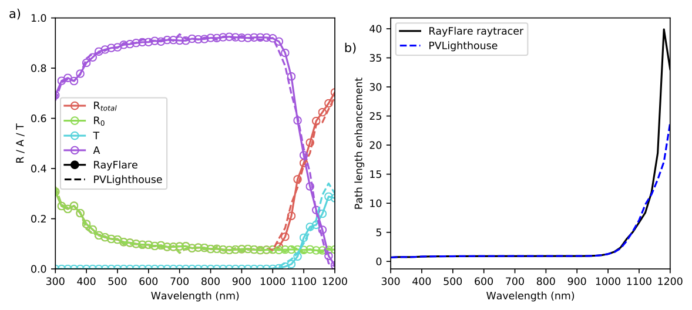

    Fig. 4. a) Comparison between the calculated reflection (total and front
    surface reflection), transmission and absorption for a c-Si wafer,
    calculated using the widely-used PVLighthouse wafer ray tracer
    :raw-latex:`\cite{PVLighthouse}` and the new Python3-based ray-tracer
    built for RayFlare. The structure considered is 300 m of c-Si
    :raw-latex:`\cite{Green2008}` with regular inverted pyramids with an
    elevation angle of 55\ :math:`^\circ` and base width 2 m on the front
    surface. The rear surface is planar, and the surrounding medium is
    air. b) Comparison of the calculated path length enhancement using
    both methods.

To check if the ray-tracing algorithm is performing as expected, it was
compared with the PVLighthouse wafer ray tracer
:raw-latex:`\cite{PVLighthouse}`, which is available as an online tool.
Note that the matrix framework discussed below was not used in these
simulations, but ray-tracing was used to track the full path of rays
through the structure. The same structures are defined in RayFlare and
the wafer ray tracer, consisting of a 300 m thick Si wafer (optical
constants in both cases were taken from :raw-latex:`\cite{Green2008}`).
The front surface of the wafer is textured with regular inverted
pyramids with an opening angle of 55\ :math:`^\circ` while the rear of
the cell is planar. The results in terms of total absorption,
transmission, front surface reflection :math:`R_0`, and total reflection
calculated through both methods are shown in Fig.
`4 <#fig:PVlighthousecomp>`__, showing very close agreement between both
ray-tracing implementations. The total reflection includes the front
surface reflection, i.e. light which is reflected during the first
interaction of the incident light with the wafer, and escape reflection
caused by rays which escape when light hits the front surface of the
cell from the inside.

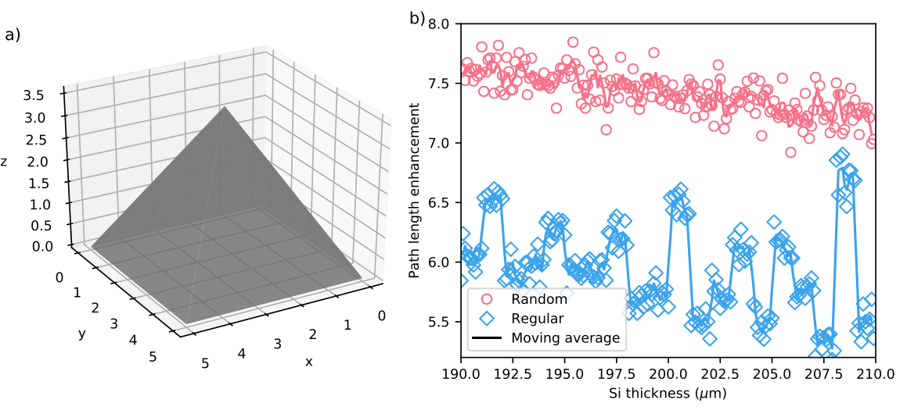

   Fig. 5. a) Example of a Delaunay triangulation surface object used for
   ray-tracing both regular and random pyramids. b) Comparison between
   the path length enhancement at 1100 nm compared to a single pass
   through a 200 m Si substrate for structures with random (pink
   circles) and regular pyramids (blue diamonds) on the front surface,
   and a planar rear surface. The open symbols show the calculated data
   while the line shows a three-point moving average.

In addition, the results for the path length enhancement in an Si
substrate patterned with random pyramids and regular pyramids depending
on the substrate thickness are shown in Fig. `5 <#fig:regrandcomp>`__.
In both the regular and random cases, the opening angle of the pyramids
is 55\ :math:`^\circ`, the typical opening angle for chemically etched
pyramids. The size of the pyramids was set to 5 m. The front surface is
patterned with upright pyramids while the rear surface is planar. The
triangulated surface used for both regular and random pyramids are shown
in Fig. `5 <#fig:regrandcomp>`__\ a; for the regular pyramids, the
overall position in the unit cell is tracked while the ray makes passes
inside the cell. To simulate the effect of random pyramids, the same
unit cell is used but the position of the ray is randomized before each
interaction with the front or rear surface (the direction vector is kept
at the value calculated during the previous surface interaction). The
path length enhancement, depending on the Si thickness, at incident
wavelength 1100 nm is shown in Fig. `5 <#fig:regrandcomp>`__\ b. This
wavelength is close to the bandgap of Si, and thus the structure is
quite transparent. Fig. `5 <#fig:regrandcomp>`__\ b shows that the path
length enhancement for the regular pyramids is significantly lower than
for the random pyramids. This is due to increased escape reflection
through the front surface due to the relationship between the location
on a pyramid at which the light enters the cell and the corresponding
point on a pyramid which it will hit after traversing the cell. For
truly random pyramids, the ray should be equally likely to encounter any
:math:`(x, y)` position of the unit cell with no correlation to its
previous interaction with the surface, while for regular pyramids, there
is a clear geometric relationship between the face of the pyramid the
ray strikes while entering the cell and the face it will strike after
traversing the cell and reflecting from the planar back surface, as
discussed in detail in :raw-latex:`\cite{Campbell1987}`. This effect can
enhance or reduce the light-trapping; if a ray strikes the equivalent
face of a pyramid through which it was coupled into the structure, it
will be totally internally reflected back into the cell, while if it
strikes the opposite face, it is likely to couple straight out of the
cell (the reflection probability below the critical angle at an Si/air
interface is around 30%). The results here are consistent with the
predictions in :raw-latex:`\cite{Campbell1987}`: random pyramids on the
front surface only, with a planar back surface, consistently perform
better than regular pyramids, and are not very sensitive to the
substrate thickness except a general trend of increasing absorption as
the thickness increases. The performance of regular pyramids is
extremely sensitive to the thickness of the substrate, shown by the
sharp oscillations in Fig. `5 <#fig:regrandcomp>`__\ b. For regular
pyramids, the predicted interval between substrate thicknesses at which
the path length enhancement reaches a local maximum is predicted to be
:raw-latex:`\cite{Campbell1987}`:

.. math:: \Delta W^{\prime}=(d / 2) \tan \left(\theta_{1}+\theta_{2}\right)

where :math:`\theta_{1}=\cot ^{-1}(\sqrt{2}) \approx 0.615` and
:math:`\theta_{2}=\sin ^{-1}\left[\left(\cos \theta_{1}\right) / n_{3}\right] \approx 0.233`,
giving :math:`\Delta W' = 2.83` m for :math:`d` = 5 m, matching the peak
spacing observed in Fig. `5 <#fig:regrandcomp>`__\ b.

The fact that regular pyramids always perform worse than random pyramids
seems somewhat counter-intuitive, since random pyramids must represent
some average over many different regular structures, and thus there must
be regular structures which outperform a random structure for any wafer
thickness and pyramid size. However, as shown in
:raw-latex:`\cite{Campbell1987}`, these optimal regular structures are
not structures where the pyramids are on a regular square grid, but
rather regular structures where the overall grid is periodically
staggered.

To further illustrate the importance of randomizing the ray direction
before rays reach a surface with similar features, where light can be
coupled out of the structure, Fig `6 <#fig:bigcomp>`__ compares the
absorption in Si at long wavelengths for multiple structures with either
regular V-grooves, random pyramids, or regular pyramids on the front
surface and V-grooves, a planar rear surface, a perfect mirror or a
perfect Lambertian reflector (see Section `1.6 <#optical:idealcases>`__)
on the rear surface. In each case, the feature size (pyramid base width
or spacing between groove maxima) is 5 m and the elevation angle of the
features is 55 :math:`^\circ`, with a substrate thickness of 100 m. This
means the front surface reflection for normal incidence in all cases is
very similar (around 10% for the wavelength range 800-1200 nm), as Fig.
`6 <#fig:bigcomp>`__ demonstrates. However, the transmission through the
back surface and escape reflection vary significantly depending on the
combination of front and rear surfaces. A structure with V-grooves on
both sides performs significantly better when the V-grooves on the two
surfaces are perpendicular; in the crossed case, most rays reaching the
back surface cannot couple straight out by striking an equivalent
surface to the one they entered through, reducing transmission, and the
direction of the rays is changed before they re-encounter the front
surface, thus also reducing escape reflection compared to the parallel
case. Similarly, random front surface pyramids significantly outperform
regular pyramids; in this case, the difference is mainly due to a
reduction in escape reflection, since transmission through the planar
back surface is similar. Random pyramids or a Lambertian scattering back
surface lead to more Lambertian behaviour, with the best absorption at
long wavelengths achieved in the structure with random front pyramids
and a Lambertian rear surface.

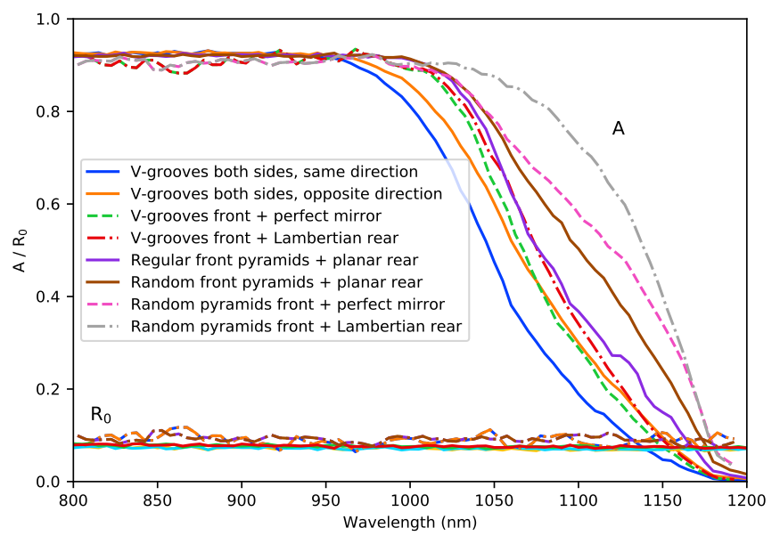

   Fig. 6. Comparison of the bulk absorption and front surface reflection
   :math:`R_0` for different structures with increasingly Lambertian
   behaviour.

A study of the convergence of the ray-tracing for different numbers of
rays and scanning points on the surface is shown in Appendix
`[appendix:rtconv] <#appendix:rtconv>`__.

.. _optical:rttmm:

Ray-tracing with integrated TMM
-------------------------------

Rather than determining the probability of reflection and transmission
using the Fresnel equations, these can be calculated using TMM if there
are multiple surface layers, one or more of which may be absorbing. To
be a useful approximation, the thickness of the surface textures should
be thinner than the lateral dimensions of the surface texture (Fig.
`2 <#fig:optosdiag>`__).

Computationally, it was found to be much faster to use pre-computed
lookup tables with reflection, transmission and absorption probabilities
rather than doing individual TMM calculations when probabilities are
needed. The TMM calculations are based on the existing TMM implemented
in Solcore (Section `[optical:solcoretmm] <#optical:solcoretmm>`__),
which is vectorized over wavelengths, and thus pre-computing the
probabilities for a large number of incidence angles and the desired
wavelength values is relatively fast compared to computing individual
probabilities as-needed, especially for a large number of rays. The
downside is that these large arrays must be stored, as discussed in
Section `1.7 <#optical:storage>`__.

.. _optical:matrix:

Matrix framework for multi-scale optical calculations
-----------------------------------------------------

The power fraction in each angular bin, :math:`P(\theta_i, \phi_j)`, at
any point within the simulation is represented as a vector
:math:`\vec{v}`:

.. math::

   \label{eq:v}
   \vec{v} = 
   \begin{pmatrix}
   P(\theta_1, \phi_1) \\
   P(\theta_1, \phi_2) \\
   \vdots\\
   P(\theta_2, \phi_1) \\
   \vdots\\
   P(\theta_m, \phi_n)
   \end{pmatrix} = \begin{pmatrix}
   1 \\
   0 \\
   \vdots\\
   0\\
   \vdots\\
   0\\
   \end{pmatrix}

The length of the vector is :math:`l`, the total number of angle bins
(combinations of :math:`\theta` and :math:`\phi`). The specific example
for :math:`\vec{v}` shown on the right-hand side of eq.
`[eq:v] <#eq:v>`__ is for light incident from :math:`\theta = 0` which
has not yet interacted with any texture. Often, this is the form
:math:`\vec{v_0}`, the vector representing the incident light, will
take. The discretization of :math:`\theta` and :math:`\phi` used here is
the one proposed in the three-dimensional implementation of OPTOS
:raw-latex:`\cite{Tucher2018}`. The polar angle bins have equal
:math:`\sin(\theta)` spacing; this means the :math:`\mathbf{k}` vector
of light projected onto the surface planes has uniform spacing
:raw-latex:`\cite{Eisenlohr2015}`. The azimuthal angle spacing is
equidistant, and the number of azimuthal angle bins for any polar angle
bin is given by
:math:`N_{\text {azimuth }}=\left\lceil c_{\text {azimuth }} \cdot r_{\text {polar }}\right\rceil`,
where :math:`r` is the index of the polar angle bin (starting from
:math:`r = 1` for the :math:`\theta = 0` bin), :math:`\lceil \rceil`
denotes rounding up the nearest integer, and :math:`c_{azimuth}` is a
number between 0 and 1 which describes how fine the discretization
should be. This discretization method means that the size of the angle
bins when projected onto the plane in which the surfaces lie is
approximately equal for all bins. The value of :math:`c_{azimuth}` used
throughout this work was :math:`1/4`, demonstrated to give accurate
results while reducing computation time relative to using
:math:`c_{azimuth} = 1` :raw-latex:`\cite{Tucher2015}`. The specific
example for :math:`\vec{v}` shown on the right-hand side of eq.
`[eq:v] <#eq:v>`__ is for light incident from :math:`\theta = 0` which
has not yet interacted with any texture. Often, this is the form
:math:`\vec{v_0}`, the vector representing the incident light, will
take.

Fig. `7 <#fig:rayflare>`__ shows an outline of how the propagation of
light through an absorbing medium is described by RayFlare. The
:math:`\vec{v}` vectors, with length :math:`l`, describe light
propagating in the incidence or transmission medium, or within the
structure, while the :math:`\vec{a}` vectors track the light absorbed in
the interface layers. The :math:`\vec{v_r}` and :math:`\vec{v_t}`
vectors track light which travels into the semi-infinite incidence and
transmission media, respectively. Note that there is a difference
between the meaning of the :math:`\vec{v_f} / \vec{v_b}` vectors inside
the structure and the :math:`\vec{v_r} / \vec{v_t}` vectors outside the
structure; the former track the total fraction of incident intensity
left in the light propagating inside the structure over the course of
the simulation, while the latter track how much power escapes from the
structure at each interaction with the interface, and thus need to be
summed over to give total reflection or transmission. The
:math:`\vec{a}` vectors have length equal to the number of layers in the
corresponding interface.

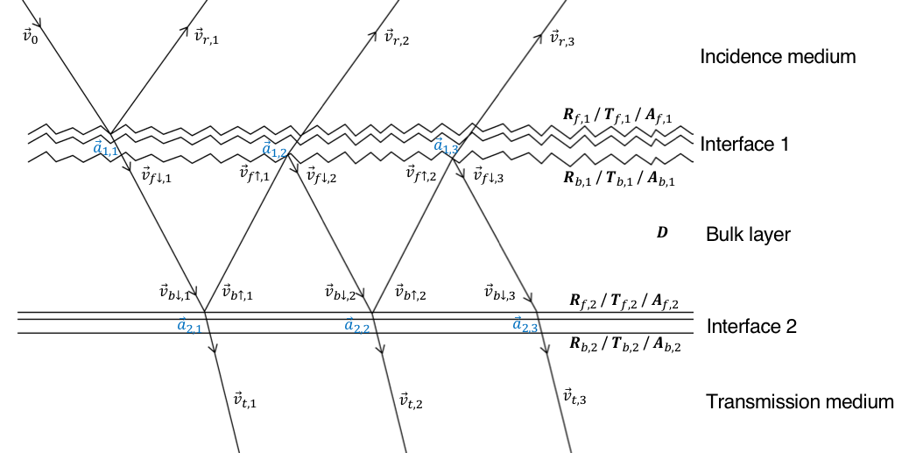

    Fig. 7. Schematic showing the labelling conventions used in RayFlare.

The :math:`\mathbf{R}` and :math:`\mathbf{T}` matrices describe the
redistribution of light into other angular channels at each interface,
either transmitted through the interface or reflected back into the same
half-plane from which the light is incident. The :math:`R` and :math:`T`
labels clarify whether the matrix describes reflection or transmission
through an interface, but could describe light incident from either the
front or back of the texture; the subscripted ‘:math:`f`’ or ‘:math:`b`’
labels are used to distinguish incidence from the front and back
respectively (‘front’ meaning the side of any interface closest to the
incidence medium), while the subscripted number describes which
interface the matrices describe. For instance, matrix
:math:`\mathbf{T_{b,1}}` describes the angular redistribution when light
incident from the inside of the structure onto the back of the front
interface is transmitted into the incidence medium. For the 3D case,
including azimuthal angle discretization, the matrices
:math:`\mathbf{R}` and :math:`\mathbf{T}` take the form:

.. math::

   \mathbf{R}, \mathbf{T}  = \left(\begin{array}{cccc}
   p(\left\{\theta_1, \phi_1\right\} \rightarrow \left\{\theta_1, \phi_1\right\}) & p(\left\{\theta_1, \phi_2\right\} \rightarrow \left\{\theta_1, \phi_1\right\}) & \dots & p(\left\{\theta_n, \phi_m\right\} \rightarrow \left\{\theta_1, \phi_1\right\}) \\
   p(\left\{\theta_1, \phi_1\right\} \rightarrow \left\{\theta_1, \phi_2\right\}) & p(\left\{\theta_1, \phi_2\right\} \rightarrow \left\{\theta_1, \phi_2\right\}) & \dots & p(\left\{\theta_n, \phi_m\right\} \rightarrow \left\{\theta_1, \phi_2\right\}) \\
   \vdots & \ddots & & \vdots &  \\
   p(\left\{\theta_1, \phi_1\right\} \rightarrow \left\{\theta_n, \phi_m\right\}) & p(\left\{\theta_1, \phi_2\right\} \rightarrow \left\{\theta_n, \phi_m\right\}) & \dots & p(\left\{\theta_n, \phi_m\right\} \rightarrow \left\{\theta_n, \phi_m\right\}) \\
   \end{array}\right)

where
:math:`p(\left\{\theta_i, \phi_j\right\} \rightarrow \left\{\theta_k, \phi_l\right\})`
is the probability that light incident from a direction in the
:math:`\left\{\theta_i, \phi_j\right\}` bin is scattered into a
direction in the :math:`\left\{\theta_k, \phi_l\right\}` bin.

The matrices describing absorption take the form:

.. math::

   \mathbf{A}=\left(\begin{array}{cccc}
   p \left( \left\{ \theta_{1}, \phi_{1}\right\} \rightarrow A_{1}\right) & p\left(\left\{\theta_{1}, \phi_{2}\right\} \rightarrow A_{1}\right) & \cdots & p\left(\left\{\theta_{m}, \phi_{n}\right\} \rightarrow A_{1}\right) \\
   p \left( \left\{ \theta_{1}, \phi_{1}\right\} \rightarrow A_{2}\right) & p\left(\left\{\theta_{1}, \phi_{2}\right\} \rightarrow A_{2}\right) & \cdots & p\left(\left\{\theta_{m}, \phi_{n}\right\} \rightarrow A_{2}\right) \\
   \vdots & \vdots & \ddots & \vdots \\
   p \left( \left\{ \theta_{1}, \phi_{1}\right\} \rightarrow A_{k}\right) & p\left(\left\{\theta_{1}, \phi_{2}\right\} \rightarrow A_{k}\right) & \cdots & p\left(\left\{\theta_{m}, \phi_{n}\right\} \rightarrow A_{k}\right) \\
   \end{array}\right)

Where
:math:`p \left( \left\{ \theta_{1}, \phi_{1}\right\} \rightarrow A_{1}\right)`
is the probability that light incident from a direction that falls in
the :math:`\left\{ \theta_{1}, \phi_{1}\right\}` bin is absorbed in
layer 1 of the interface. The dimensions of the
:math:`\mathbf{A_{f/b, i}}` matrix depend on which interface it is
describing; the number of columns is :math:`l`, as for the
:math:`\mathbf{R}` and :math:`\mathbf{T}` matrices, while the number of
rows is :math:`k`, equal to the number of layers in the interface with
label :math:`i`. In this labelling convention, and the code, ‘layer 1’
is the layer at the front of the interface (closest to the incidence
medium), and not necessarily the first layer the light encounters; light
incident from inside the structure on the front surface would encounter
the :math:`k`\ th layer first.

Note that while Fig. `7 <#fig:rayflare>`__ shows the light travelling
through the structure as discrete rays to avoid confusion, light is
generally scattered into multiple directions at each interface; the
vectors do not represent light travelling in a single direction, but
record the fraction of the incident intensity in each angular bin. The
definition of the angles :math:`\theta` and :math:`\phi` themselves is
somewhat ambiguous; Fig. `8 <#fig:angle_convention>`__ shows how light
interacting with an interface with incident angles
:math:`\left\{\theta_1, \phi_1 \right\}` is scattered into outgoing
angles :math:`\left\{\theta_2, \phi_2 \right\}`. :math:`\theta` is the
polar angle from the positive :math:`z`-direction, while :math:`\phi` is
the azimuthal angle counter-clockwise from the :math:`x`-axis (when
viewed from the :math:`z > 0` half-plane). This coordinate system fully
describes three-dimensional space with ranges
:math:`0 \leq \theta < \pi` and :math:`0 \leq \phi < 2\pi`. Keeping the
same definition of :math:`\theta` and :math:`\phi`, the scattered ray
travelling away from the first interaction in the
:math:`\left\{\theta_2, \phi_2 \right\}` direction will then be incident
on a subsequent surface with polar angle
:math:`\theta_2' = \pi - \theta_2` and azimuthal angle
:math:`\phi_2' = \pi + \phi_2`. The same coordinate system, with the
:math:`z`-axis pointing towards or into the incidence medium of the
structure, is used for all interfaces. The transformation
:math:`\theta \rightarrow \pi - \theta` and
:math:`\phi \rightarrow \pi + \phi` is applied to angles describing
‘outgoing’ directions to convert them into ‘incoming’ directions after
each interaction with a surface (Fig.
`8 <#fig:angle_convention>`__). [2]_

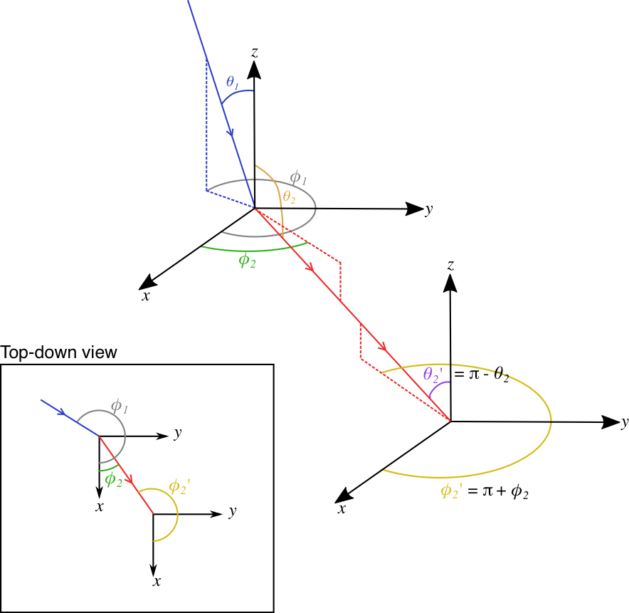

   Fig. 8. Schematic of the angle conventions used in RayFlare, and how they are
   transformed for incoming and outgoing light paths.

Considering these definitions, it can be deduced that the
:math:`\mathbf{R}` matrices describe light incident with some value of
:math:`\theta` scattered so the outgoing direction (prior to a
transformation into an ‘incoming’ vector) is in the same half-plane (so
if :math:`\theta < \pi/2` before the interaction, it remains so after
the interaction with the surface, and vice versa). The
:math:`\mathbf{T}` matrices describe light where the value of
:math:`\theta` is changed so the outgoing ray is travelling into the
other half-plane. The attenuation of the intensity in the bulk, which in
these simulations are assumed to be thick enough that interference
effects within the bulk can be ignored, is described by matrix
:math:`\mathbf{D}` using the Beer-Lambert absorption law:

.. math::

   D = \begin{bmatrix} 
   e^{-\alpha d/ |\cos{\theta_1}|} & 0 & \dots & 0  \\
   0& \ddots &  & 0 \\
   0& \vdots & \vdots & 0\\
   0 & \dots & 0& e^{-\alpha d/|\cos{\theta_m}|}  \\

   \end{bmatrix}

The absolute value sign ensures that it does not matter whether the
:math:`\mathbf{D}` matrix is applied before or after the transformation
from outgoing to incoming direction, since
:math:`\cos(\pi-x) = -\cos(x)`. There will be multiple identical
diagonal entries for each :math:`\theta`, depending on how many
corresponding :math:`\phi` channels there are. The matrix
:math:`\mathbf{D}` has the same dimensions as :math:`\mathbf{R}` and
:math:`\mathbf{T}`. Note that the :math:`\mathbf{R_{b,1}}` and
:math:`\mathbf{R_{f,2}}` matrices are equivalent to the
:math:`\mathbf{B}` and :math:`\mathbf{C}` matrices, respectively, in the
OPTOS formalism :raw-latex:`\cite{Eisenlohr2015}`; the labelling of the
:math:`\mathbf{D}` matrix in Fig. `7 <#fig:rayflare>`__ is unchanged
from OPTOS.

After each surface interaction or pass through the bulk of the
structure, the power remaining as a fraction of the incident power can
be calculated by adding up all the entries in :math:`\vec{v}` inside the
structure:

.. math:: P = \sum_{m=1}^{l} \vec{v}_m \\

Note that the sum here is over all the angular bins, of which there are
:math:`l`. The initial total power sums to one:
:math:`\sum_{m=1}^l \vec{(v_0)}_m = 1`. With reference to Fig.
`7 <#fig:rayflare>`__ for the vector and matrix labelling, the
absorption, reflection and transmission can be calculated iteratively as
follows:

.. math::

   \begin{aligned}
       \label{eq:OPTOS}
       \begin{split}
           \textrm{First interaction with front surface:} \\
           &\vec{v}_{f \downarrow, 1}=\mathbf{T_{f, 1} }\vec{v}_{0}\\
           &\vec{v}_{r, 1}=\mathbf{R_{f, 1}} \vec{v}_{0}\\
           &\vec{a}_{1,1}=\mathbf{A_{t, 1}} \vec{v}_{0} 
       \end{split}\end{aligned}

.. math::

   \begin{aligned}
       \begin{split}
           \textrm{Iterative calculation:} \\
           &\vec{v}_{b \downarrow, i}=\mathbf{D}~ \vec{v}_{f\downarrow i} \\
           &\vec{a}_{2, i}=\mathbf{A_{f, 2}}~ \vec{v}_{f\downarrow i} \\
           &\vec{v}_{t, i}=\mathbf{T_{f, 2}}~\vec{v}_{f\downarrow i} \\
           &\vec{v}_{b \uparrow, i}=\mathbf{R_{f, 2}} ~\vec{v}_{f\downarrow i} \\
           &\vec{v}_{f \uparrow, i}=\mathbf{D} ~v_{b \uparrow, i} \\
           &\vec{a}_{1, i+1}=\mathbf{A_{b, 1} }~\vec{v}_{f \uparrow, i} \\
           &\vec{v}_{r, i+1}=\mathbf{T_{b, 1}}~\vec{v}_{t \uparrow_{1}} \\
           &v_{f\downarrow, i+1}=\mathbf{R_{b, 1}}~v_{f \uparrow, i} \\
           &\vdots 
       \end{split}\end{aligned}

This iterative calculation can be repeated until the power remaining in
the vector :math:`\vec{v}_{f/b}` describing light travelling inside the
structure is below a certain threshold defined by the user, i.e. all the
light has been absorbed, transmitted, or reflected. At this point, all
the relevant information will be stored in the :math:`\vec{v}` and
:math:`\vec{a}` vectors. Although other values may be of interest, some
of the most commonly-used can be calculated as:

.. math::

   \begin{aligned}
       \begin{split}
       \textrm{Calculating absorption in the bulk:} \\
       &A_{\downarrow, i}=\sum_{l} \vec{v}_{f\downarrow , i}-\sum_{l} \vec{v}_{b \downarrow, i}\\
       &A_{\uparrow,i} =\sum_{l} \vec{v}_{b \uparrow. i}-\sum_{l} \vec{v}_{f \uparrow, i}\\
       &A_{total} = \sum_{i} (A_{\downarrow, i} + A_{\uparrow,i}) \\
       \textrm{Calculating absorption in the interfaces:} \\
       &\vec{a}_1 = \sum_{i} \vec{a}_{1,i} \\
       &\vec{a}_2 = \sum_{i} \vec{a}_{2,i} \\
       \end{split}\end{aligned}

.. math::

   \begin{aligned}
       \begin{split}
       \textrm{Calculating reflection and transmission per angular bin:} \\
       &\mathbf{R}(\theta, \phi)=\sum_{i} \vec{v}_{r, i} \\
       &\mathbf{T}(\theta, \phi)=\sum_{i} \vec{v}_{t, i} \\
       \textrm{Calculating total reflection and transmission:} \\
       &R_{\text {total }}=\sum_{l} \mathbf{R}\left(\theta, \phi\right) \\
       &T_{\text {total }}=\sum_{l} \mathbf{T}\left(\theta, \phi\right)
       \end{split}\end{aligned}

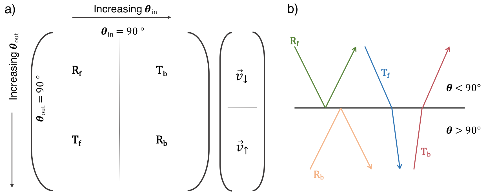

   Fig. 9. Schematic of a) the layout of the redistribution matrices for each
   surface and the angular vector :math:`\vec{v}` and b) the
   corresponding processes at the interface.

The relationship of the different matrices :math:`\mathbf{R_f}`,
:math:`\mathbf{T_b}`, :math:`\mathbf{T_f}` and :math:`\mathbf{R_b}` to
values of :math:`\theta` for the ray before and after interacting with a
surface are shown in Fig. `9 <#fig:matrixparts>`__. :math:`\mathbf{R_f}`
and :math:`\mathbf{T_f}` affect only downwards-travelling rays
(:math:`\theta_{in} < \pi/2`), while :math:`\mathbf{R_b}` and
:math:`\mathbf{T_b}` affect only upwards travelling rays
(:math:`\theta_{in} > \pi/2`). The :math:`\mathbf{R}` matrices will
redistribute light into the same half-plane while the :math:`\mathbf{T}`
matrices will redistribute light into the other half-plane.
Computationally, this means that if full matrices and vectors with
:math:`0 \leq \theta \leq \pi` are used, three-quarters of the matrices
and half of the vectors :math:`\vec{v}` will, by definition, be empty
during any given matrix multiplication. Thus, only the relevant non-zero
parts of the matrices and vectors are actually multiplied. The matrices
:math:`\mathbf{R_{b,2}}`, :math:`\mathbf{T_{b,2}}` and
:math:`\mathbf{A_{b,2}}`, corresponding to incidence from the back on
the rear surface of the cell, are not automatically computed, since it
is assumed no light will enter the structure from the semi-infinite
transmission medium.

The iterative nature of the calculations means that in addition to the
values shown above, more complex metrics can be tracked, e.g. how much
of the incident power is absorbed on each pass of the bulk; the effect
of direct reflection :math:`R_0` (due to the first interaction of the
incident light with the front surface of the cell) and escape reflection
(due to light escaping into the incidence medium during subsequent
interactions with the front surface); or how much light is absorbed in
the front interface layers due to light incident from outside vs. inside
the cell. Note that the dependence on wavelength of each of the matrices
has not been made explicit so far to simplify the description of the
model, but in fact the iterative calculation is carried out
simultaneously for all wavelengths using three-dimensional arrays with
dimensions wavelength, index of the incoming angles, and index of the
outgoing angles (the Python package xarray is used to deal with the
high-dimensional arrays).

A key advantage of the matrix approach to optical modelling problems is
that although changing either of the surfaces means that the relevant
:math:`\mathbf{R}`, :math:`\mathbf{T}` and :math:`\mathbf{A}` matrices
must be recalculated using an appropriate method, repeating the
simulation with a different bulk thickness requires very little
additional simulation time as only matrix :math:`\mathbf{D}` has to be
recalculated, which is computationally trivial. If only one of the
surfaces is changed, only the matrices for that surface need to be
recalculated, rather than for the whole structure. This is especially
useful when comparing realistic structures with idealized textures
(Section `1.6 <#optical:idealcases>`__); comparing the performance of a
realistic back reflector or scatterer with that of a perfect mirror does
not require re-computing the behaviour of the whole structure.

Absorption in individual layers
-------------------------------

Including absorption in the surface textures, in addition to bulk
absorption and reflection/transmission at the interfaces is a natural
extension of the angular matrix framework; instead of light being
redistributed into other angles, it can be redistributed into a vector
which describes absorption in each layer. This extension was also
developed for the OPTOS method :raw-latex:`\cite{Tucher2018}`, but was
conceptualized and developed independently for the RayFlare framework
and the matrix approach for calculating total absorption is discussed in
the previous section.

The ray-tracing method, whether used with the Fresnel equations or a
lookup table with values calculated through TMM, is a Monte Carlo method
and therefore inherently stochastic; rays can be reflected, absorbed, or
transmitted with some probability, depending on the structure being
considered, the wavelength, and the point of incidence on the surface.
If lookup tables for an interface with multiple layers are used, there
is a total probability that the light will be absorbed somewhere in the
stack, and the individual probabilities of absorption in each of the
layers. It is not necessary to choose which layer the absorption takes
place in stochastically, since these probabilities are calculated
exactly from the TMM; the choice of reflection, transmission or
absorption is made stochastically, but the distribution of absorbed
photons between the layers can be done exactly based on the relative
probabilities. Thus, if a ray is absorbed, RayFlare checks in the lookup
table what the probability of absorption per layer is (for the correct
wavelength, side of approach, polarization and local incidence angle)
and stores this information. At the end of the simulation, a matrix can
then be generated relating the global incidence angle in terms of
:math:`\theta` and :math:`\phi` bins to the probability of absorption in
each layer; the intensity of absorbed rays is divided between the layers
exactly based on the relative probability of absorption in that layer.
However, because the absorption probabilities per layer are determined
analytically using TMM while the fraction of rays reflected and
transmitted are calculated stochastically, the situation can arise that
(e.g. for a two-layer stack)
:math:`R+T+A_{\text {layer } 1}+A_{\text {layer }_{2}} \neq 1`. Thus,
when generating the final matrices at the end of the simulation for each
wavelength, the total number of rays which are not reflected or
transmitted (i.e. must therefore have been absorbed) is stored, so that
the fraction of absorbed rays :math:`A` is known for each global
incidence angle. This is then used to scale the absorption fractions per
layer, so that :math:`\sum_{i=1}^{n_{\text {layers}}} A_{i} \equiv A`.

.. _optical:profiles:

Absorption profiles
~~~~~~~~~~~~~~~~~~~

When using the combined TMM/ray-tracing approach, it is possible to
calculate absorption profiles within the surface layers by considering
the local incidence angle and using existing TMM methods to generate
absorption profiles. The absorption profile at a depth :math:`z` in a
coherent layer in a TMM calculation can be expressed analytically as
:raw-latex:`\cite{Byrnes2016}`:

.. math::

   \label{eq:depthTMM}
   a(z)=A_{1} e^{2 z \operatorname{Im}\left(k_{z}\right)}+A_{2} e^{-2 z \operatorname{Im}\left(k_{z}\right)}+A_{3} e^{2 i z \operatorname{Re}\left(k_{z}\right)}+A_{3}^{*} e^{-2 i z \operatorname{Re}\left(k_{z}\right)}

where :math:`k_z = 2 \pi n \cos \theta / \lambda_{vac}` is the
:math:`z`-component of the wavevector :math:`\vec{k}`. Eq.
`[eq:depthTMM] <#eq:depthTMM>`__ can be found by calculating
:math:`-d(\mathbf{P} \cdot \mathbf{\hat{z}})/dz`, the negative of the
derivative with respect to the :math:`z` position of the
:math:`z`-component of the Poynting vector
:math:`\mathbf{P} = \frac{1}{2} \operatorname{Re}\left[\left(\mathbf{E}^{*} \times \mathbf{H}\right)\right]`.
Physically, :math:`A_1` describes the intensity of the
backward-travelling wave in the layer, :math:`A_2` describes the
intensity of the forward-travelling wave, and :math:`A_3` describes
interference between these waves. :math:`A_1`, :math:`A_2` and
:math:`A_3` depend on the layer structure under consideration and the
wavelength. Note that if we consider a structure in which interference
can be ignored, the expression for :math:`a(z)` at normal incidence
simplifies to
:math:`a(z) = A_2 e^{-2 z (2 \pi \kappa)/ \lambda_{vac}} = A_2 e^{-\alpha z}`,
which is the negative of the first derivative with respect to :math:`z`
of the Beer-Lambert law (:math:`I = I_0 e^{-\alpha z}`) (with
:math:`A_2 = \alpha I_0`), as expected.

When the TMM lookup tables are generated, the relevant parameters
(:math:`A_1`, :math:`A_2`, :math:`A_3`, and :math:`k_z`) used to
calculate the absorption profile for light incident on the layer stack
from a specific (local) angle are stored along with the reflection,
transmission, and absorption probabilities. :math:`A_1` and :math:`A_2`
are, by definition, real, while :math:`k_z` and :math:`A_3` are
generally complex numbers for absorbing layers. During the ray-tracing
process, the local incidence angle for each ray which gets absorbed must
be stored if the absorption profile is to be calculated, so the correct
values of the absorption profile parameters can be used (the difference
between the overall angle of incidence on the surface and the local
incidence angle is shown in Fig. `1 <#fig:raytrace>`__\ b). The values
in the lookup table assume that an intensity of “1” is incident on the
front layer of the stack; however, this is generally only true during
the very first interaction of the light with the front surface, and not
for subsequent interactions. Thus, it is necessary to scale the
parameters :math:`A_1`, :math:`A_2` and :math:`A_3`, which relate to the
intensity of the light, to account for the actual intensity incident on
the surface at each interaction.

There is an added complication related to the issue discussed above for
calculating absorption per layer in the combined TMM/ray-tracing
approach; since the absorption fraction per layer has to be scaled to
ensure that :math:`R+A+T=1` for each global incidence angle, it follows
that :math:`A_1`, :math:`A_2` and :math:`A_3` must also be scaled
accordingly. In addition, the data in the R, A and T redistribution
matrices is in terms of global incidence angle, while the absorption
profile depends on the local incidence angle. Thus, it is necessary to
know the relationship between the global incidence angle and the local
incidence angle for rays which were absorbed. Therefore, similar to the
scaling to account for previous absorption, we must also scale the
absorption profiles to account for how much of a contribution each local
angle makes. For regular textures like pyramids, clearly a global
incidence angle will relate to only a small number of local incidence
angles.

Although the intensity incident on the surface at each interaction can
only be determined during the full matrix calculation, the relationship
between the global and local incidence angle and thus the scaling
required for :math:`A_1`, :math:`A_2` and :math:`A_3` is known after
ray-tracing, before the matrix calculation takes place. During the
ray-tracing procedure, the relationship between the global incidence
angle and the local incidence angle for rays which are absorbed is
recorded in a matrix, with rows describing the local incidence angle
bins and columns describing the global incident angle bin (in terms of
both :math:`\theta` and :math:`\phi` as discussed above). Thus the
dimension of this matrix is :math:`(n_{theta~bins}, n_{angle~bins})`.
The global/local angle matrix is used to scale :math:`A_1`, :math:`A_2`
and :math:`A_3` for each global incidence angle. Thus, we end up with a
very large multi-dimensional matrix storing the values of :math:`A_1`,
:math:`A_2`, :math:`A_3` and :math:`k_z` for each layer and for each
local angle per global incidence angle. This can then be used to
generate a depth-dependent profile by using the equation
`[eq:depthTMM] <#eq:depthTMM>`__ for each local angle with a non-zero
contribution, and then adding all the local angle contributions at each
wavelength. The final result is a matrix with the different :math:`z`
positions along the rows, and the different global incidence angles
along the columns.

Finally, this matrix is scaled so that the integrated total of all these
contributions is consistent with the R and T probabilities. This final
matrix can be used just like the R, T and A matrices; when multiplying a
:math:`\vec{v}` vector, this gives the resulting absorption profile from
that interaction with the surface. At the end of the matrix
multiplication, all these contributions can be added up to come of with
an overall absorption profile. Care must be taken to take into account
how absorption profiles generated for front incidence and rear incidence
are added together, since the light encounters the structure in the
opposite direction, so the absorption profiles for rear incidence must
be flipped.

.. _optical:absorbingincidence:

Absorbing incidence media
-------------------------

In absorbing incidence media, the meaning of the incidence angle
:math:`\theta` becomes somewhat ambiguous, as discussed in Section
`[theory:tmm] <#theory:tmm>`__. This can be understood by considering
the wavevector :math:`\vec{k}` of a plane wave. For a general plane wave
(assuming without loss of generality that we are in the :math:`x-z`
plane, where the incidence medium lies at :math:`z = 0` – see Fig.
`8 <#fig:angle_convention>`__ for the angle convention):

.. math:: \vec{k} = \frac{2 \pi (n+i\kappa)}{\lambda}(\sin\tilde{\theta}, 0, \cos\tilde{\theta})

Where the complex refractive index :math:`\tilde{n}` is expressed
explicitly in terms of its real and imaginary parts. If
:math:`\kappa = 0` (non-absorbing medium), the meaning of the angle
:math:`\theta` is clear; it is the angle from the normal at which the
light is travelling. But if we have :math:`\kappa \neq 0`, this meaning
becomes less clear. Specifically, :math:`\tilde{n}\sin\tilde{\theta}`
will not be a real number if :math:`\theta` is a real number; this
implies that there is dissipation of power in the direction parallel to
the incident medium, since the :math:`x`-component of the wavevector is
not real, and therefore this cannot be an infinite plane wave. So
:math:`\tilde{n}\sin\tilde{\theta}` must be real for a plane wave, and
if :math:`\tilde{n}` is complex, this means :math:`\sin\tilde{\theta}`
must be complex, and thus :math:`\tilde{\theta}` must be complex. This
is equivalent to saying Snell’s law
(:math:`n_0 \sin\theta_0 = n_1\sin\theta_1`) holds even for interfaces
where one or both of the media are absorbing. Although it is possible to
deduce a relationship between the direction from which power is
incident, a useful definition within the RayFlare matrix framework, and
the complex angle :math:`\tilde{\theta}` (see Appendix
`[appendix:imagtheta] <#appendix:imagtheta>`__), this has not currently
been implemented in RayFlare; instead, the much simpler assumption that
:math:`\kappa = 0` for all incidence media has been made. This means
that for light incident from inside the bulk structure,
:math:`\kappa = 0` is set to zero. The justification for this
simplification is as follows:

*  To be treated correctly within the RayFlare framework, the ‘bulk’
   layer must be thick relative to the wavelength.

*  If the bulk is thick relative to the wavelength and has high
   :math:`\kappa`, then a large fraction of the light entering the bulk
   will be absorbed before ever encountering the back surface; so while
   the high incidence-angle entries in the redistribution matrix for the
   rear surface, and back of the front surface, may not be accurate,
   this will not affect the overall results because a negligible
   fraction of the light encounters those surfaces at the problematic
   wavelengths.

*  If the bulk has low :math:`\kappa`, meaning the light may make many
   passes through the bulk before being absorbed and the high
   incidence-angle entries in the matrix become relevant (e.g. in an
   indirect semiconductor or glass), the angle at which power is
   travelling and the angle :math:`\theta` will be very similar since
   :math:`\kappa` is close to zero.

.. _optical:idealcases:

Ideal cases
-----------

To explore fundamental limits to light trapping or compare the
performance of a device design with theory, it is useful to include a
convenient way of generating matrices for several cases where the
optical behaviour can be calculated analytically. Two cases used
frequently in discussing the performance of light-trapping structures
(see Section `[litrev:lighttrapping] <#litrev:lighttrapping>`__) have so
far been included in RayFlare: a perfect mirror and a Lambertian
scatterer. The perfect mirror case is straightforward: light hitting the
interface at a polar angle :math:`\theta` and azimuthal angle
:math:`\phi` is scattered into outgoing direction
:math:`\{\theta, \phi + \pi\}`. 100 % reflectivity at all wavelengths is
assumed, so the redistribution matrix is identical for all wavelengths,
with a single entry equal to ‘1’ per row and column of the matrix, with
the location of the entry describing the change in angle.

A perfectly Lambertian scatterer is an ideal diffuse reflector, having
the same radiance (radiant flux per unit projected unit solid angle)
regardless of the viewing angle. As the viewing angle increases from the
normal, the projected area of the emitting surface appears to decrease
proportional to :math:`\cos{\theta}`, and thus the radiant flux should
also decrease in order to maintain the same radiant flux. The power
reflected into a polar angle bin with angle :math:`\theta` and width
:math:`d\theta` can be written as:

.. math:: dP \propto \cos(\theta) d\theta

the azimuthal dependence, :math:`\phi`, has been ignored; it is clear
from the symmetry of the coordinate system and the requirement of an
ideal diffuse reflector that the power should be divided evenly between
the :math:`\phi` bins, which are of equal size for any given
:math:`\theta`. The total power (summing over :math:`\phi` bins), as a
fraction of incoming power, scattered into the bin at :math:`\theta`
with a width of :math:`d\theta` is thus given by
:math:`\cos{\theta} d\theta`, with the final matrix normalized so that
each column (corresponding to each incoming direction) sums to 1.

.. _optical:storage:

Storing information
-------------------

For many structures commonly used in solar cells, such as pyramids or
gratings, light will be scattered into specific directions according to
its incidence angle, rather than being scattered across all possible
outgoing directions (although this is not the case for randomly
scattering structures, or theoretical perfect Lambertian scattering).
This means that the redistribution are generally extremely sparse; thus
the matrices are stored in a sparse matrix format using the Python
package . This is useful since typically a large number of matrices are
generated during a simulation, since the matrices are
wavelength-dependent. In the case of perfect Lambertian scattering,
where all the matrix elements describing reflection are non-zero and the
scattering is assumed to be the same at all wavelengths, only a single
matrix is stored as opposed to one matrix per wavelength to save storage
space. The largest files which need to be stored are those for the TMM
lookup tables, and those storing the parameters for calculating
absorption profiles (Section `1.4.1 <#optical:profiles>`__); these
multi-dimensional matrices are stored in NetCDF format using the
package.

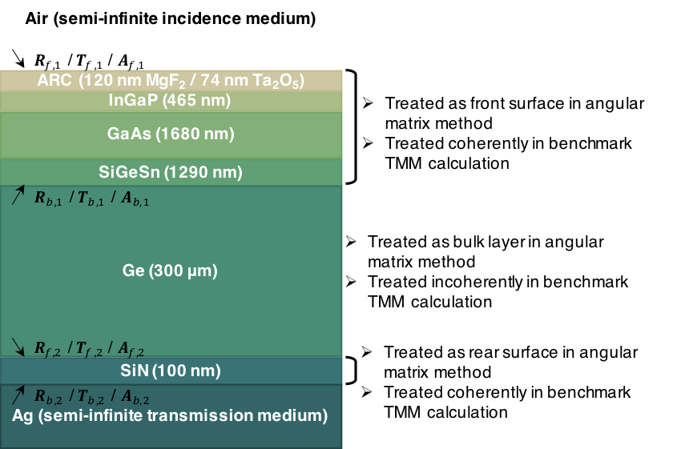

   Fig. 10. The four-junction solar cell optical structure used for validation of
   the RayFlare angular matrix model. The treatment of the layers in
   both RayFlare and the TMM reference calculation, done using Solcore’s
   existing TMM implementation, is indicated. The labels
   :math:`R_{f,1}`, :math:`T_{f,1}` etc. refer to the labels used in
   Fig. `7 <#fig:rayflare>`__ for the angular matrices.

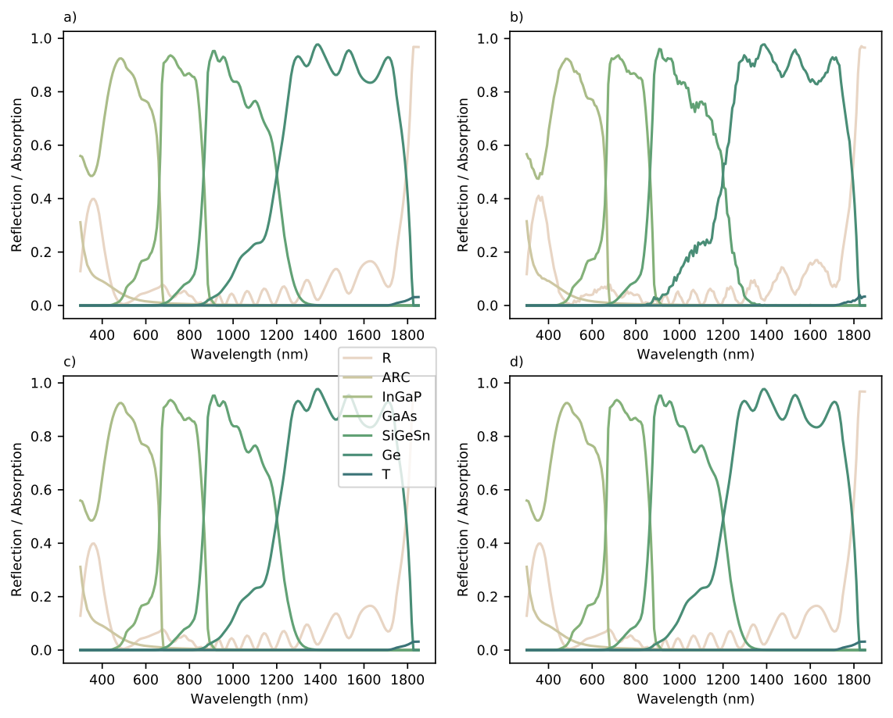

   Fig. 11. Calculated reflection, absorption per layer and transmission in a 4J
   solar cell-like optical structure with normally-incident unpolarized
   light, calculated using the RayFlare matrix multiplication framework
   and a) a TMM model, b) a ray-tracing model with TMM lookup-tables and
   c) an RCWA model to populate the redistribution matrices. d) shows
   the expected result, calculated using Solcore’s TMM model (separate
   from RayFlare).

.. _optical:validation2:

Matrix method validation
------------------------

In order to confirm if the the matrix multiplication and methods for
populating the redistribution matrices are working as expected, a planar
multi-layer structure with a thick, incoherent layer can be considered.
Such a structure can be modelled using the TMM method from Solcore
directly, using the ability to treat layer incoherently, or by using the
angular matrix framework with redistribution matrices calculated through
TMM, ray-tracing in combination with a TMM lookuptable, or RCWA. As
discussed previously, using ray-tracing or RCWA to calculate reflection,
absorption and transmission through planar layers does not offer
additional insight beyond that from a TMM calculation, but choosing a
structure which can be modelled using all these methods allows a simple
check of the angular binning method used in each, and the matrix
multiplication itself.

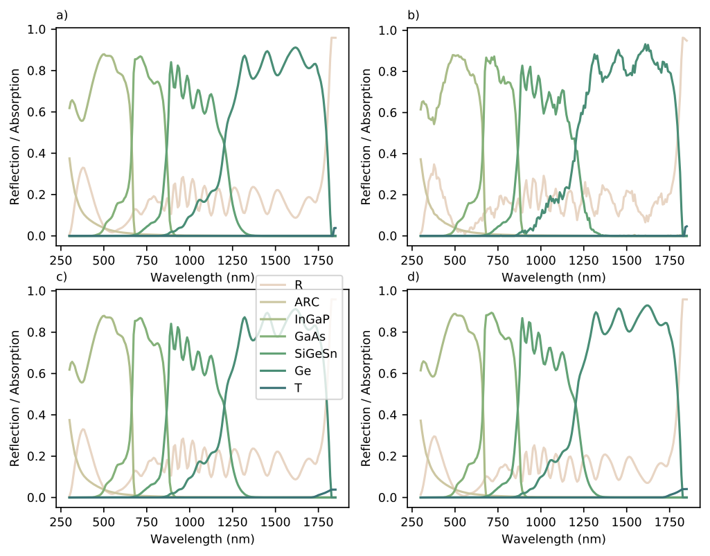

   Fig. 12. Calculated reflection, absorption per layer and transmission in a 4J
   solar cell-like optical structure with :math:`p`-polarized light
   incident at 70\ :math:`^\circ` from the surface normal, calculated
   using the RayFlare matrix multiplication framework and a) a TMM
   model, b) a ray-tracing model with TMM lookup-tables and c) an RCWA
   model to populate the redistribution matrices. d) shows the expected
   result, calculated using Solcore’s TMM model (separate from
   RayFlare).

The structure considered for the angular matrix model validation, and
validation of the ray-tracing, TMM and RCWA methods as they are
implemented to generate the redistribution matrices, is shown in Fig.
`10 <#fig:optosvalidation_schem>`__. This structure is based on the
optimized layer structure for a 4J solar cell with a SiGeSn sub-cell
(Section `[sigesn:devices] <#sigesn:devices>`__). Using Solcore’s TMM
method, this structure is simply a Solcore layer stack with the thick Ge
layer treated incoherently. In the RayFlare matrix method, this Ge layer
is the bulk medium described by the matrix :math:`\mathbf{D}` and the
thinner layers (MgF\ :math:`_2`, Ta\ :math:`_2`\ O\ :math:`_5`, GaInP,
GaAs and SiGeSn) form the front interface (this is also shown in Fig.
`10 <#fig:optosvalidation_schem>`__). When the TMM and RCWA methods are
specified in RayFlare, the reflection, absorption and transmission of
these three layers is calculated by treating them as a coherent stack
with an infinite transmission medium made of Ge, and the matrix method
is used to couple this behaviour to the back surface. If ray-tracing is
specified, a lookup table is first generated using TMM. Clearly, there
is much redundancy between these methods, but the aim is to demonstrate
the correct functioning of each method individually, and the connections
between them. The optical behaviour of this structure was calculated at
several angles of incidence, and for unpolarized, :math:`s` and
:math:`p`-polarized light, using the four methods listed above. The
comparison for normally incident, unpolarized light is shown in Fig.
`11 <#fig:modelvalid>`__, showing that the results match extremely
closely; the only deviation observed are the noisy oscillations in the
result calculated through ray-tracing, due to the stochastic nature of
this method. Results for :math:`p`-polarized light incident at a
glancing angle of 70\ :math:`^\circ` from the normal is shown in Fig.
`12 <#fig:modelvalid_70>`__. Results for :math:`s`-polarization and
unpolarized light at non-zero incidence angles were also checked
extensively to make sure the different methods were consistent.

To validate the performance of RayFlare for more complex structures,
Fig. `14 <#fig:optoscomp>`__ compares the output of RayFlare with the
results of OPTOS as reported in :raw-latex:`\cite{Tucher2015}`. Three
structures are considered, each with the bulk layer consisting of 200 m
of c-Si; (a) a structure with a planar front and crossed diffraction
grating with period 1000 nm on the rear, (b) a structure with a planar
back and regular inverted pyramids (opening angle 55\ :math:`^\circ`) on
the front and (c) a structure with pyramids on the front and a grating
on the rear. The final structure uses the matrices for the front surface
calculated for structure (a) and the matrix for the rear calculated for
structure (b), so no additional time-consuming simulations are needed.
There is a close match between the simulations in all cases. The dip in
absorption in structure (a) around 1075 nm appears more pronounced in
the RayFlare simulation, likely due to different RCWA methods being used
with different numbers of Fourier orders (the number of orders used was
not reported in the OPTOS paper). Fig. `15 <#fig:optoscompmatrix>`__
shows the redistribution matrices (summarized over all the azimuthal
angles :math:`\phi`) for light incident from inside the structure on the
front surface pyramids, and for the rear-side diffraction grating.

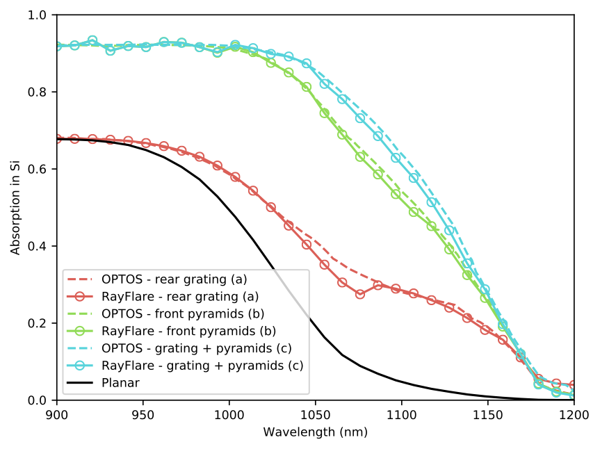

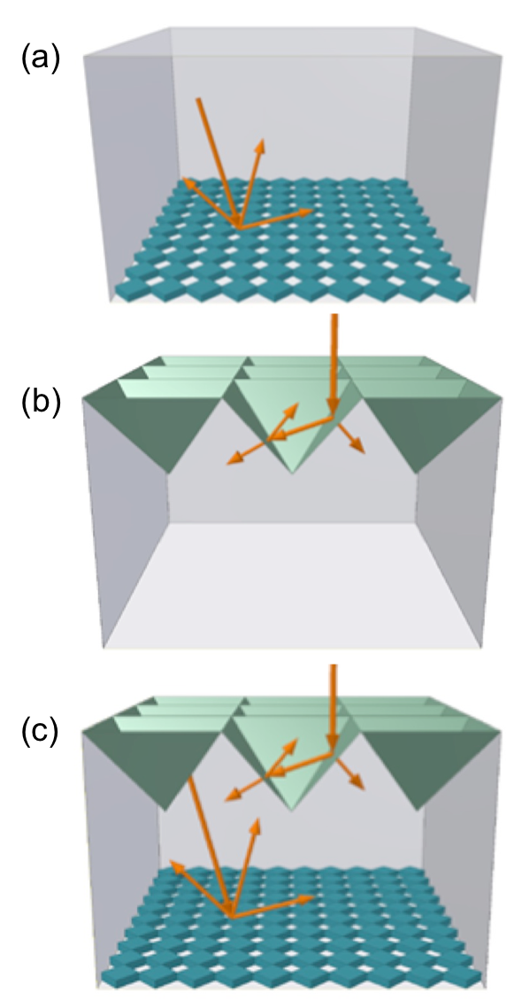

   Fig. 13. Comparison of absorption in 200 m of bulk Si calculated using
   RayFlare (solid lines with open circles) and OPTOS (dashed lines) for
   (a) a structure with a planar front surface and a crossed diffraction
   grating at the rear (red lines), (b) a structure with inverted
   pyramids on the front of the structure and a planar back surface
   (green lines) and (c) an Si layer with both structures, inverted
   pyramids on the front surface and a diffraction grating on the rear
   surface (blue lines). Schematics of the structures, reproduced from
   :raw-latex:`\cite{Tucher2015}` are shown on the right.

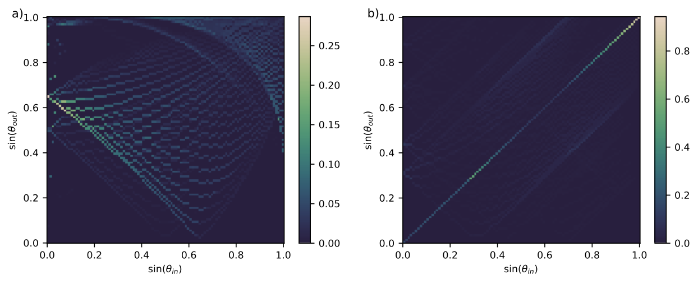

   Fig. 14. Reflection angular redistribution matrices, summarized over polar
   angles :math:`\theta`, for light with vacuum wavelength 1100 nm
   incident on a) inverted pyramids and b) a crossed diffraction grating
   with period of 1 m. In both cases, incidence from inside the cell
   structure (Si) is considered. Note that the pyramids are inverted
   when considered from the outside of the cell, so physically the rays
   traced will encounter upright pyramids from the silicon.

    Table 1. Layer structure of the perovskite/Si tandem cell. The
    layer thicknesses and materials are taken from
    :raw-latex:`\cite{Sahli2018}`. The sources for optical constant data
    for each material is listed in addition to the equivalent current
    corresponding to the photons absorbed in each layer based on the
    RayFlare model.

      +-------------+----------+-------------+-------------+-------------+
      |             | **Role** | **Thickness | **Optical   | **Current** |
      | **Material**|          | (nm)**      | constant    |             |
      |             |          |             | source**    |             |
      +=============+==========+=============+=============+=============+
      | MgF\        |          | 100         | :raw-late   |             |
      |  :math:`_2` |          |             | x:`\cite{Ro |             |
      |             |          |             | driguez-deM |             |
      |             |          |             | arcos2017}` |             |
      +-------------+----------+-------------+-------------+-------------+
      | IZO         |          | 110         | :raw        |             |
      |             |          |             | -latex:`\ci |             |
      |             |          |             | te{Morales- |             |
      |             |          |             | Masis2015}` |             |
      |             |          |             | :ma         |             |
      |             |          |             | th:`r(O_2)  |             |
      |             |          |             | = 0.10`\ %, |             |
      |             |          |             | annealed    |             |
      +-------------+----------+-------------+-------------+-------------+
      | SnO\        |          | 10          | :m          |             |
      |  :math:`_2` |          |             | ath:`n = 2` |             |
      +-------------+----------+-------------+-------------+-------------+
      | C\ :m       |          | 15          | :raw-       |             |
      | ath:`_{60}` |          |             | latex:`\cit |             |
      |             |          |             | e{Ren1991}` |             |
      +-------------+----------+-------------+-------------+-------------+
      | LiF         |          | 1           | :raw-       |             |
      |             |          |             | latex:`\cit |             |
      |             |          |             | e{Alonso-Al |             |
      |             |          |             | varez2018}` |             |
      +-------------+----------+-------------+-------------+-------------+
      | Perovskite  |          | 440         | :raw-latex  |             |
      |             |          |             | :`\cite{Wer |             |
      |             |          |             | ner2018}`\* |             |
      +-------------+----------+-------------+-------------+-------------+
      | Spiro-TTB   |          | 12          | :math       |             |
      |             |          |             | :`n = 1.65` |             |
      +-------------+----------+-------------+-------------+-------------+
      | a-Si        |          | 6.5         | meas        |             |
      | (n-type)    |          |             | ured\ :math |             |
      |             |          |             | :`^\dagger` |             |
      |             |          |             | :raw-l      |             |
      |             |          |             | atex:`\cite |             |
      |             |          |             | {Alonso-Alv |             |
      |             |          |             | arez2019c}` |             |
      +-------------+----------+-------------+-------------+-------------+
      | a-Si        |          | 6.5         | measured    |             |
      | (intrinsic) |          |             | :raw-l      |             |
      |             |          |             | atex:`\cite |             |
      |             |          |             | {Alonso-Alv |             |
      |             |          |             | arez2019c}` |             |
      +-------------+----------+-------------+-------------+-------------+
      | c-Si        |          | 260,000     | :raw-la     |             |
      |             |          |             | tex:`\cite{ |             |
      |             |          |             | Green2008}` |             |
      +-------------+----------+-------------+-------------+-------------+
      | a-Si        |          | 6.5         | measured    |             |
      | (intrinsic) |          |             | :raw-l      |             |
      |             |          |             | atex:`\cite |             |
      |             |          |             | {Alonso-Alv |             |
      |             |          |             | arez2019c}` |             |
      +-------------+----------+-------------+-------------+-------------+
      | a-Si        |          | 6.5         | measured    |             |
      | (p-type)    |          |             | :raw-l      |             |
      |             |          |             | atex:`\cite |             |
      |             |          |             | {Alonso-Alv |             |
      |             |          |             | arez2019c}` |             |
      +-------------+----------+-------------+-------------+-------------+
      | ITO         |          | 240         | measured    |             |
      |             |          |             | :raw-l      |             |
      |             |          |             | atex:`\cite |             |
      |             |          |             | {Alonso-Alv |             |
      |             |          |             | arez2019c}` |             |
      +-------------+----------+-------------+-------------+-------------+
      | Ag          |          | se          | :raw-la     |             |
      |             |          | mi-infinite | tex:`\cite{ |             |
      |             |          |             | Jiang2016}` |             |
      +-------------+----------+-------------+-------------+-------------+

Application of integrated optical modelling
-------------------------------------------

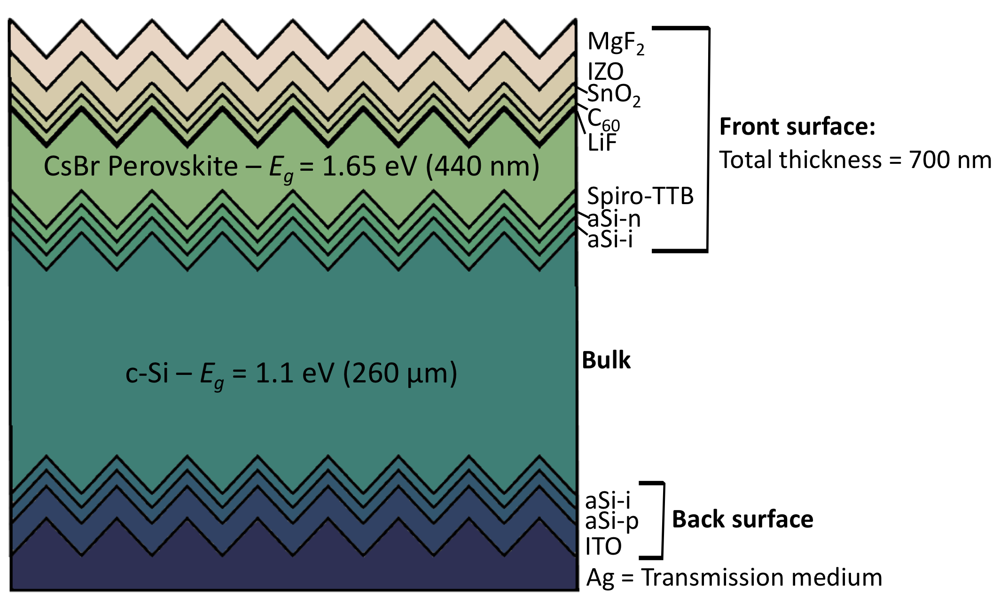

   Fig. 15. Structure of the perovskite/Si tandem cell structure. The incidence
   medium is air, with :math:`n = 1`, while the semi-infinite
   transmission medium is silver. The front surface includes the
   perovskite, while the bulk material in RayFlare is the thick c-Si
   layer.

A useful application of the RayFlare framework is studying the effect of
thin-film layers deposited conformally onto a surface texture, e.g.
pyramids. An example of an application of such a structure in PV is a
perovskite on silicon tandem cell, currently a device structure with a
large amount of research interest. One possible device structure
involves depositing the relatively thin perovskite layer, and the
necessary contacting and anti-reflection coating layers, conformally
onto the pyramid structure of the Si, such as the device presented in
Sahli et al. :raw-latex:`\cite{Sahli2018}`. This preserves the
well-optimized and effective use of pyramids to increase the path length
of light in the silicon cell and increase absorption. The structure from
:raw-latex:`\cite{Sahli2018}` is shown in Fig.
`16 <#fig:perovskiteSistructure>`__, with the details of the layer
structure and the source of the optical constants in each case shown in
Table `1 <#tab:perovskiteSi>`__. The layer thicknesses in the stack are
as reported in :raw-latex:`\cite{Sahli2018}`.

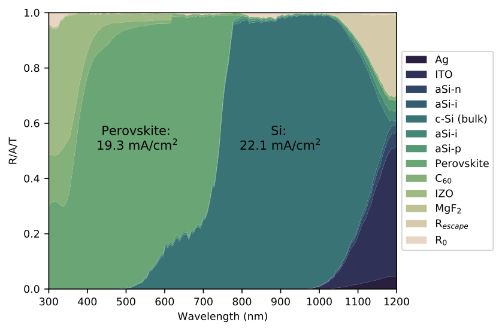

   Fig. 16. Reflection (direct and escape), absorption per layer, and
   transmission into the Ag substrate calculated using RayFlare for the
   perovskite/Si tandem cell structure shown in Fig.
   `16 <#fig:perovskiteSistructure>`__. The photogenerated currents are
   shown, calculated using eq. `[eq:Jph] <#eq:Jph>`__ from the AM1.5G
   solar spectrum. The front and rear surfaces were described using the
   integrated TMM/ray-tracing framework.

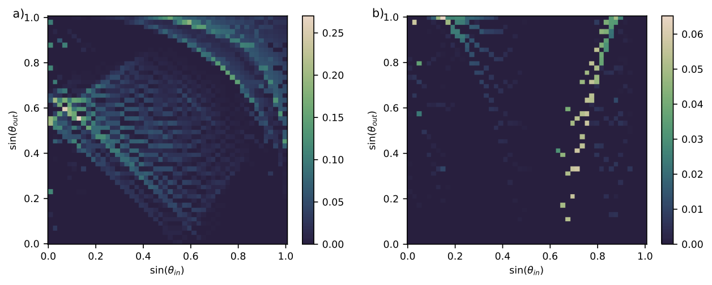

   Fig. 17. Examples of redistribution matrices calculated for the perovskite/Si
   tandem cell calculated using 100 incident/outgoing bins for the polar
   angle :math:`\theta` with azimuthal discretization
   :math:`c_{azimuth} = 0.25`. These matrices describe a) reflection
   back into the cell and b) transmission into the incidence medium
   (air) for light which is incident from inside the Si on the pyramidal
   front surface. These matrices are summarized per :math:`\theta` bin
   (all the azimuthal :math:`\phi` bins are added together and
   normalized).

This structure was modelled used RayFlare’s combined TMM/ray-tracing
approach to calculate the redistribution matrices for each surface, with
the Si as the bulk coupling medium across which the angular matrix
method is applied. The overall result, with absorption in each layer,
reflection, and transmission into the Ag substrate, is shown in Fig.
`17 <#fig:perovskiteSisummary>`__. Examples of the matrices generated by
RayFlare using the integrated ray-tracing/TMM lookup table approach are
shown in Fig. `18 <#fig:perovskiteSimatrices>`__, showing the
redistribution matrix for reflection and transmission of light incident
from inside the cell on the front pyramidal surface. The TMM lookup
tables used during ray-tracing for the front surface are shown in Fig.
`19 <#fig:lookuptables>`__, for light incident from outside the cell
(left column) and inside the cell (right column). Fig.
`19 <#fig:lookuptables>`__\ a shows that front surface reflection is low
except at extremely glancing incidence angles [3]_, with some visible
Fabry-Perot oscillations. In Fig. `19 <#fig:lookuptables>`__\ c and e we
see low transmission and high absorption, respectively, at wavelengths
below the bandgap of the perovskite (:math:`\approx` 700 nm), where most
incident light is absorbed in the surface layers, and high transmission
into the Si bulk at wavelengths above the bandgap. For rear incidence,
we can clearly see the effect of total internal reflection in Fig.
`19 <#fig:lookuptables>`__\ d, showing no transmission out of the cell
into air above incidence angle of :math:`\approx 15 ^\circ` (with the
exact value of the critical angle depending on the refractive index of
the layers and thus the wavelength). Light incident from inside the cell
can also be absorbed in the front surface layers (Fig.
`19 <#fig:lookuptables>`__\ f).

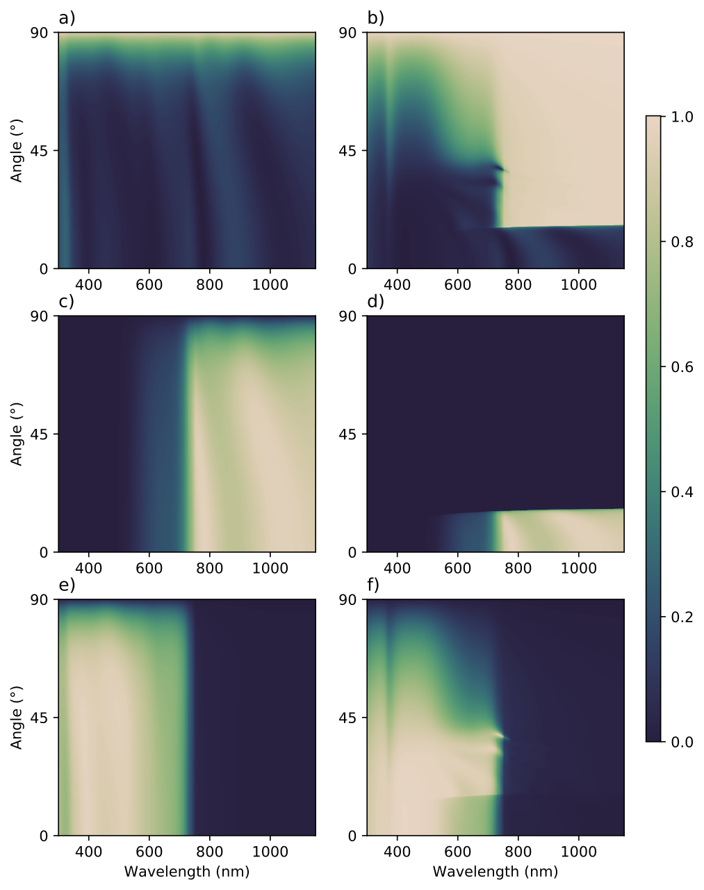

   Fig. 18. Example of the lookup tables produced by RayFlare, in this case for
   the front surface of the perovskite/Si structure in Fig.
   `16 <#fig:perovskiteSistructure>`__; this information is used by the
   ray-tracing algorithm. The plots show incidence angle and wavelength
   dependence for the probability of: a) Reflection for front incidence
   (from air); b) reflection for rear incidence (from Si); c)
   transmission for front incidence (from air); d) transmission for rear
   incidence (from air); e) total absorption in the surface layers for
   front incidence; f) total absorption in the surface layers for rear
   incidence.

Fig. `20 <#fig:perovskiteSiperpass>`__ shows escape reflection (light
transmitted through the front Si surface from inside the cell) and
absorption in the bulk during the first 25 interactions with the surface
or passes through the cell. At short wavelength, all the light is
absorbed before reaching the front surface again, and escape reflection
is low, and absorption in a single pass in the Si is high. As the
wavelength increases, light is able to make more passes through the cell
without being absorbed, leading to increased escape reflection through
the front surface as the light has an increasing number of chances to be
transmitted out of the cell as the number of interactions with the front
surface increases close to the bandgap of Si.

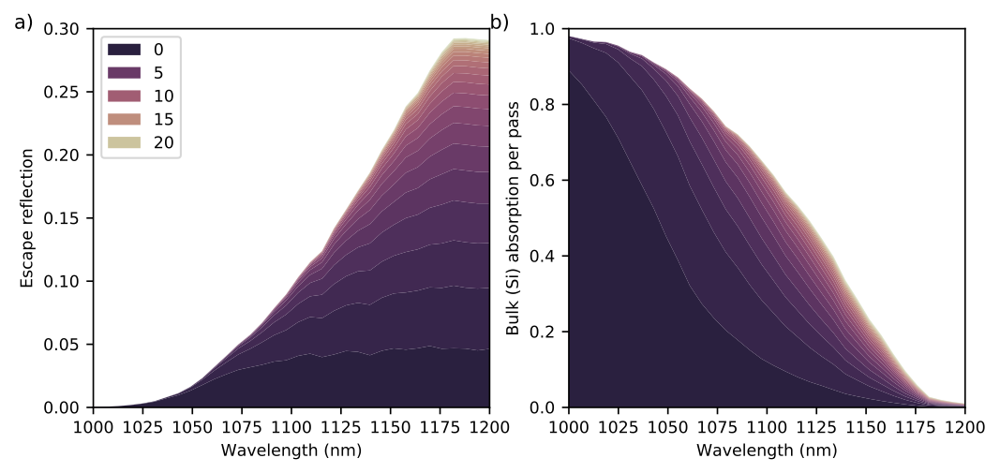

   Fig. 19. a) Escape reflection per interaction with the front surface and b)
   absorption in the bulk Si per pass for the perovskite/Si structure.
   The different colours represent the contribution of each
   pass/interaction, as shown in the legend.

Fig. `22 <#fig:profilescomp>`__\ a shows the absorption profile in the
front surface layers of the structure, calculated as outlined in Section
`1.4.1 <#optical:profiles>`__, at three different incident wavelengths.
At short wavelengths, there is considerable parasitic absorption in the
IZO layer, and the absorption profile at the start of the perovskite
layer is very sharp as :math:`\alpha` is high at short wavelengths. At
an intermediate wavelength of 540 nm, closer to the bandgap of the
perovskite layer, the absorption profile is more extended throughout the
layer, and thin-film interference is clearly visible. At long
wavelengths, almost no light is absorbed in the deposited layers, and
light is instead able to reach the c-Si cell.

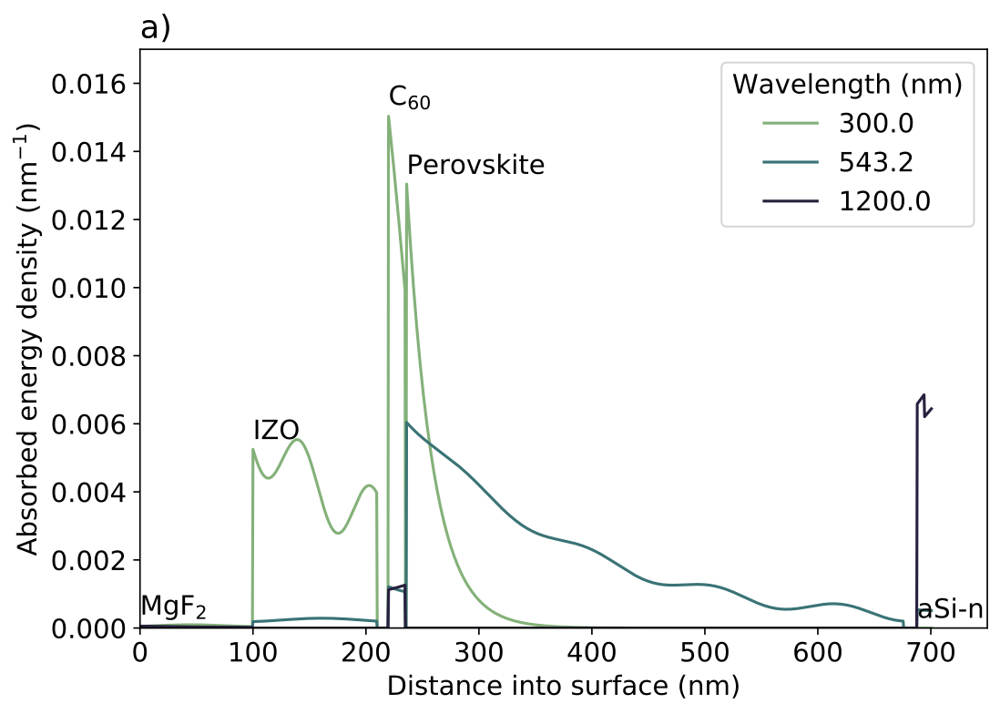

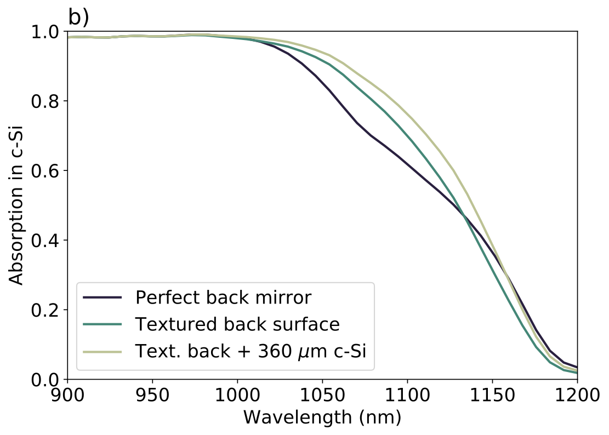

    Fig. 20. a) Absorption profile in the surface layers deposited on the
    pyramidal c-Si surface of the structure in Fig.
    `16 <#fig:perovskiteSistructure>`__ at three different wavelengths.
    b) Comparison of the absorption in Si at long wavelengths for the
    original textured back surface, a perfect mirror, or the original
    textured surface with an increase in the c-Si thickness.

Fig. `22 <#fig:profilescomp>`__\ b shows the effect on the
long-wavelength absorption in Si of replacing the textured back surface
of the Si cell with a perfect mirror, or keeping the texture the same
and increasing the Si thickness to 360 m (from 280 m). A perfect mirror
actually performs slightly worse than the realistic structure; this is
because the real back surface is already a good reflector due to the
silver deposited on the rear, and in addition randomizes the ray
directions further so behaves more ‘Lambertianly’ than the perfect
mirror, which reflects but does not scatter light into more oblique
angles. As expected, increasing the c-Si thickness increases the
absorption near the bandgap. Both of these results are extremely quick
to calculate; the first case requires only the matrices for the rear
surface to be changed to the trivial matrix for a perfect mirror (see
Section `1.6 <#optical:idealcases>`__), while changing the bulk
thickness only requires the matrix :math:`\mathbf{D}` to be changed,
which uses only straightforward Beer-Lambert calculations.

.. _optical:further:

Planned further work
--------------------

Multiple relatively simple improvements to RayFlare could significantly
decrease computation time. For ray-tracing, automatically checking the
convergence as rays are traced and terminating the process at each
wavelength once some sufficiently small standard deviation or confidence
interval (adjustable by the user) has been reached prevents an
unnecessarily large number of rays being traced for e.g. a simple
interface or at wavelengths where the bulk is highly absorbing. For the
matrix framework, populating the matrices can be time-consuming
depending on the surfaces and methods chosen, and depending on the
wavelength, some matrix entries may not be important; for instance, at
wavelengths where the bulk material is very highly absorbing, the
entries for the interaction with the rear surface, or for interaction
with light encountering the front surface from inside the cell are not
needed since no light will reach these surfaces at these wavelengths.
Even for weaker bulk absorption, if the front surface scatters only into
specific angles during the first interaction of light with the surface
(e.g. a pyramidal surface), only the entries corresponding to angles
which the light will be scattered into in the bulk need to be calculated
for the rear surface if the light is able to make less than three passes
through the cell.

RayFlare shares functionality with the optical modelling side of
Solcore; in addition to the matrix framework, structures using any of
the optical modelling methods (TMM, ray-tracing, ray-tracing with TMM or
RCWA) for the full stack can also be defined. All these methods allow
absorption profiles to be calculated, which allow a generation profile
to be generated for Solcore’s electrical solvers. An absorption profile
can also be calculated using the matrix framework. Therefore, an easy
way for RayFlare to interface with Solcore, and generate absorption
profiles which can be used directly by Solcore’s electrical solvers,
should be straightforward to implement and will expand the optical
methods available for use with Solcore even further.

.. [1]
   The formalism could also be expanded to a stack with multiple
   interfaces and several ‘bulk’ materials, though this has not yet been
   implemented.

.. [2]
   Applying this transformation often does not affect the results, as
   surfaces with mirror symmetry along the :math:`x` and :math:`y` axes,
   such as regular square-based pyramids or a square diffraction
   grating, are not affected by the transformations
   :math:`\theta \rightarrow \pi - \theta` and
   :math:`\phi \rightarrow \pi + \phi`. However, implementing this
   transformation ensures the framework can be used for surfaces which
   do not exhibit such symmetry.

.. [3]
   For normally incident light incident on a surface with regular
   pyramids with elevation angle 55\ \ :math:`^\circ`, the only possible
   local angle of incidence is 35\ \ :math:`^\circ`; however, because
   generating the lookup tables is fast, the full angular space is
   considered.
