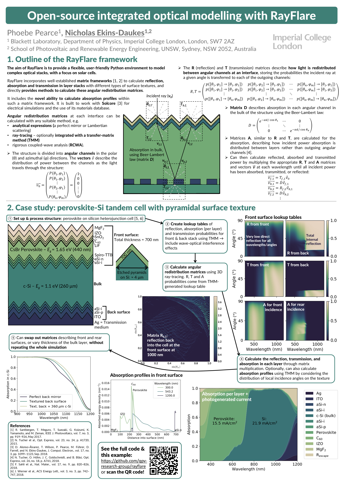

.. RayFlare documentation master file, created by
   sphinx-quickstart on Wed Sep 16 23:27:47 2020.
   You can adapt this file completely to your liking, but it should at least
   contain the root `toctree` directive.

.. include:: README.rst

.. toctree::
   :maxdepth: 2
   :caption: Contents:

   Installation/installation
   Theory/theory
   Examples/examples.rst
   Matrix/matrix_method
   Ray_tracing/ray_tracing
   TMM/tmm
   RCWA/rcwa
   Textures/textures.rst
   Analytic/analytic.rst
   Options/user_options.rst

Indices and tables
==================

* :ref:`genindex`
* :ref:`modindex`
* :ref:`search`

